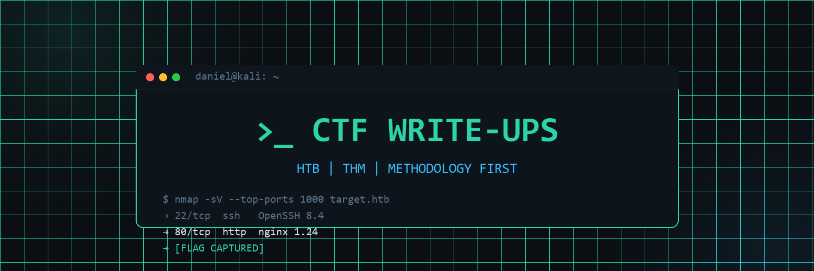

<p align="center">
  _ CTF WRITE-UPS — HTB · THM · Methodology-first penetration testing write-ups" width="100%">
</p>

<h1 align="center">>_ CTF WRITE-UPS</h1>

<p align="center">
  <strong>Methodology-first offensive security write-ups from Hack The Box & TryHackMe.</strong><br>
  <em>Every machine documented like a professional engagement: enumerate → understand → exploit → escalate → <strong>report</strong>.</em>
</p>

<p align="center">
  <a href="https://xxdndxx.github.io/ctf-writeups/"></a>
  <a href="#-writeup-index"></a>
  <a href="#-certification-roadmap"></a>
  <a href="#-writeup-index"></a>
</p>

<p align="center">
  <a href="https://www.linkedin.com/in/daniel-dayan-a66322352/"></a>
  <a href="https://xxdndxx.github.io"></a>
  <a href="https://github.com/xXDNDXx"></a>
</p>

---

## >_ About This Repository

I'm **Daniel** — an entry-level penetration tester building a public, verifiable track record of offensive security work. This repo is my working portfolio: every machine I root on Hack The Box or TryHackMe gets a full, professional write-up, written the way I would document a real client engagement.

What makes these write-ups different from a typical CTF dump:

- **Methodology over answers.** Each write-up explains *why* a step was taken, not just the command that worked. Dead ends are documented — the path to the flag is the lesson.
- **Reporting discipline.** Every machine follows the same structure used in professional pentest reports: overview, methodology, findings, exploitation, remediation, lessons learned. Writing these is deliberate practice for OSCP/CPTS exam reports and real-world deliverables.
- **Full kill chain.** First nmap scan to root shell — reconnaissance, enumeration, initial access, privilege escalation, and post-exploitation — with evidence and commands at every stage.
- **Ethics first.** Retired machines and lab environments only, in line with platform disclosure policies. All techniques documented for educational purposes and authorized testing only.

> [!NOTE]
> 📖 **Prefer reading in book form?** The full site — with dark terminal theme, search, and navigation — is deployed at **[xxdndxx.github.io/ctf-writeups](https://xxdndxx.github.io/ctf-writeups/)**

---

## >_ Navigation

| Resource | What you'll find |
|---|---|
| 🌐 [**Published Site**](https://xxdndxx.github.io/ctf-writeups/) | MkDocs Material site — the best reading experience |
| 📋 [**Write-up Index**](#-writeup-index) | Every machine below, at a glance |
| 🧭 [**My Methodology**](docs/methodology.md) | The playbook I run on every engagement/box |
| 📄 [**Write-up Template**](_TEMPLATE.md) | The standardized 8-section skeleton every write-up follows |
| 🛠️ [**Contributing Guide**](docs/contributing.md) | Folder structure, naming rules, publishing steps |
| 💼 [**My Portfolio**](https://xxdndxx.github.io) | Main cybersecurity portfolio site |

### Repository Layout

```
ctf-writeups/
├── branding/                     # banner, logo, social preview (this repo's visual identity)
│   ├── banner.png                # README hero banner
│   ├── og.png                    # social sharing preview (1200×630)
│   └── logo.png                  # terminal ">_" logo
├── docs/                         # MkDocs site source = the write-ups themselves
│   ├── HTB/                      # Hack The Box machines (retired only)
│   │   └── <Difficulty>/<Machine>/
│   │       ├── README.md         # the full write-up
│   │       └── assets/           # numbered screenshots for that machine
│   ├── THM/                      # TryHackMe rooms (same structure)
│   ├── methodology.md            # my engagement playbook
│   ├── TEMPLATE.md               # write-up skeleton (site copy)
│   └── contributing.md           # how to publish a write-up here
├── hooks/callouts.py             # GitHub-style callouts → Material admonitions
├── _TEMPLATE.md                  # write-up template (repo copy)
├── mkdocs.yml                    # site config + navigation
└── .github/workflows/deploy.yml  # auto-deploys site on push to main
```

---

## >_ Skills & Toolset

The core stack I practice with on every box, mirroring the tools used by professional penetration testing teams.

### Recon & Enumeration


### Web Application Attacks


### Exploitation & Shells


### Privilege Escalation


### Scripting & Automation


Exploit PoC adaptation, recon automation, log parsing, payload generation — if I run it twice, I script it.

### Defender's Perspective — my unfair advantage


My background is SOC/blue-team (650-hour Cisco & Fortinet program, Splunk/QRadar triage). When I attack, I know exactly what the defenders see — and I write remediation sections defenders can actually use. **Purple-team thinking** makes my reports better and my tradecraft quieter.

---

## >_ Certification Roadmap

Where I am, and where I'm headed. Certs are mile-markers, not trophies — every one backed by the hours visible in this repo.

| Status | Certification | Why it matters |
|---|:---|---|
| 🎯 **In progress** | **CompTIA Security+** | Baseline security fundamentals — the HR door-opener for entry-level roles |
| 📚 Studying | **HTB CPTS** | Practical, hands-on pentest methodology — the closest thing to real engagements in a cert |
| 🔜 Planned | **eJPT** | Junior pentester exam — first hands-on validation of network/web exploitation |
| 🔜 Planned | **OSCP** | The industry-standard, 24-hour hands-on pentest certification — the end-goal |
| 🎓 Completed | **ITQ Cyber Bootcamp (650h)** | MoD-sponsored, Cisco & Fortinet specialization, SOC workflows |

<details>
<summary><strong>Why this order?</strong></summary>

**Security+ first** — it's the baseline credential recruiters filter on, and it plugs theory gaps cheaply.
**CPTS before OSCP** — HTB Academy's CPTS is widely regarded as *harder and more thorough* than the OSCP in methodology, and it's cheaper. It builds the report-writing discipline that OSCP's graded report demands.
**eJPT** sits conveniently between Security+ and OSCP as a confidence-builder and resume credential for entry-level roles.
**OSCP last** — it's expensive; I want to walk in prepared, not experimental.

</details>

### Currently Learning

- **HTB Academy modules** — working through the offensive path
- **Active Directory attack techniques** — Kerberoasting, DCSync, delegation attacks
- **Report writing** — practicing the OSCP-style deliverable on every machine here

---

## >_ Write-up Index

Machine write-ups, newest first. Difficulty: 🟢 Easy · 🟡 Medium · 🔴 Hard · ⚫ Insane

### Hack The Box

| Machine | Difficulty | OS | Kill Chain | Write-up |
|---|:---:|:---:|---|---|
| [**Base**](https://xxdndxx.github.io/ctf-writeups/HTB/Easy/Base/) | 🟢 Easy | Linux | strcmp type-juggling auth bypass → unrestricted file upload RCE → password reuse → sudo find privesc | [📄](docs/HTB/Easy/Base/README.md) |
| <!-- Add new HTB machines above this row --> | | | | |

### TryHackMe

| Room | Difficulty | Kill Chain | Write-up |
|---|:---:|---|---|
| [**Support**](https://xxdndxx.github.io/ctf-writeups/THM/Medium/Support/) | 🟡 Medium | hydra brute-force → forged isITUser role cookie → BOLA API abuse → skin LFI → hard-coded master password → command injection | [📄](docs/THM/Medium/Support/README.md) |
| <!-- Add new THM rooms above this row --> | | | |

> [!TIP]
> **Looking for a specific technique?** The [published site](https://xxdndxx.github.io/ctf-writeups/) has full-text search — try "kerberoast", "SUID", or "type juggling".

---

## >_ My Write-up Methodology

Every write-up in this repo follows the same 8-section professional report structure:

| # | Section | What it contains |
|---|---|---|
| 1 | **Challenge Overview** | Platform, machine, difficulty, OS, attack vector, metadata box |
| 2 | **Reconnaissance** | nmap methodology, port/service/version table, reasoning per flag |
| 3 | **Enumeration** | Web/directory fuzzing, service enumeration, why each probe was chosen |
| 4 | **Exploitation / Foothold** | The vulnerability class, root-cause analysis, payload, user flag |
| 5 | **Privilege Escalation** | Systematic post-exploitation enum, the vector, root flag |
| 6 | **Remediation & Hardening** | Client-ready fixes mapped to each finding — blue-team actionable |
| 7 | **Lessons Learned** | Techniques internalized, what to add to the cheatsheet, time-to-reflect |
| 8 | **Artifacts** | Scans, scripts, loot — evidence, like a real engagement |

Full template: [**_TEMPLATE.md**](_TEMPLATE.md) · Full methodology: [**docs/methodology.md**](docs/methodology.md)

---

## >_ Contribute

Write-ups follow one professional structure, so every machine reads the same way. Grab [the template](_TEMPLATE.md), copy it into the right difficulty folder, add one nav line in `mkdocs.yml`, and open a PR — pushes to `main` deploy the site automatically.

```bash
git clone https://github.com/xXDNDXx/ctf-writeups
pip install -r requirements.txt
mkdocs serve   # → http://127.0.0.1:8000
```

> [!IMPORTANT]
> **Write-up policy:** retired machines only (HTB forbids write-ups of active machines), flags stay behind spoiler toggles, and every command gets a short "why" — teach, don't paste.

---

## >_ Disclaimer

All targets covered here are **intentionally vulnerable lab environments** (Hack The Box, TryHackMe) or my own systems. Nothing in this repository should ever be used against systems **without explicit written authorization**. I practice offensive security to build the skills that defend real networks — and to prove I can.

---

<div align="center">

**`>_ Built by [Daniel Dayan](https://github.com/xXDNDXx) — future OSCP · [Portfolio](https://xxdndxx.github.io) · [LinkedIn](https://www.linkedin.com/in/daniel-dayan-a66322352/)`**


</div>
