# THM — Support | Illustrated Writeup

A new internal **Support Operations Platform** has been deployed to assist IT and helpdesk teams. The application handles user management, internal APIs, and system-level operations. However, security was not the primary focus during development. Several features rely on user-controlled input and weak trust boundaries.

From that brief I expected API-flavoured bugs — **BOLA**, mass assignment, data exposure — so I went in looking for weak inputs and overly trusting clients. This writeup follows the full path: a recon pass and content discovery, a brute-forced helpdesk password, a forged role cookie, a path-traversal source leak, and finally a command injection.


*Figure 1 — The Support room brief, from the TryHackMe room.*

| | |
|---|---|
| **Target** | 10.48.186.187 |
| **Services** | SSH (OpenSSH 9.6p1) + HTTP (Apache 2.4.58) |
| **Tools** | nmap · gobuster · hydra · browser DevTools |

**My path:** nmap → gobuster → hydra → theme/cookie recon → crack the `isITUser` MD5 → IT Admin Panel + `/api` → skin LFI → master password → admin login → command injection. **Admin flag:** `THM{I_AM_ADMIN999}` · **User flag:** `THM{GOT_THE_FLAG001}`

| Item | Value |
|---|---|
| Initial account | `help@support.thm` |
| Cracked password | `snoopy` (hydra, http-post-form) |
| Cookie after login | `isITUser = md5("false") = 68934a3e9455fa72420237eb05902327` |
| Forged cookie | `isITUser = md5("true") = b326b5062b2f0e69046810717534cb09` |
| Admin account (via /users/1) | `specialadmin@support.thm` |
| Master password | `support@110` → login with the `@` removed → `support110` |

---

## Directory

| # | Section |
|---|---|
| 01 | [Recon — nmap](#01-recon-nmap) |
| 02 | [Content discovery — gobuster](#02-content-discovery-gobuster) |
| 03 | [Brute forcing the login — hydra](#03-brute-forcing-the-login-hydra) |
| 04 | [First look — theme settings and a suspicious cookie](#04-first-look-theme-settings-and-a-suspicious-cookie) |
| 05 | [Cracking the isITUser cookie](#05-cracking-the-isituser-cookie) |
| 06 | [IT Admin Panel and the internal API](#06-it-admin-panel-and-the-internal-api) |
| 07 | [Skin LFI — source disclosure](#07-skin-lfi-source-disclosure) |
| 08 | [Admin username → admin flag](#08-admin-username-admin-flag) |
| 09 | [Command injection via the date widget](#09-command-injection-via-the-date-widget) |
| 10 | [Reflection](#10-reflection) |
| — | [Summary — the chain](#summary-the-chain) |

---

## 01 Recon — nmap

A quick `nmap -sVC` scan showed only two services: **SSH** and **HTTP**. Port 80 hosted the Support Operations Panel, so that was the target — and the scan output already hinted that cookies matter here: `PHPSESSID` ships without the `httponly` flag.

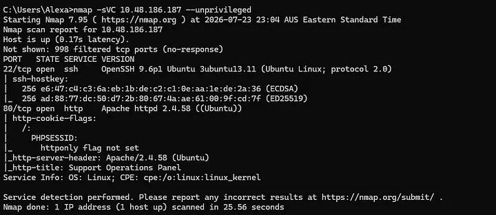
*Figure 2 — `nmap -sVC`: OpenSSH 9.6p1 on 22, Apache 2.4.58 on 80, title "Support Operations Panel".*

---

## 02 Content discovery — gobuster

I spent the next 30 minutes discovering content and looking for vulnerabilities. **gobuster** in directory enumeration mode over a SecLists wordlist mapped the application out:

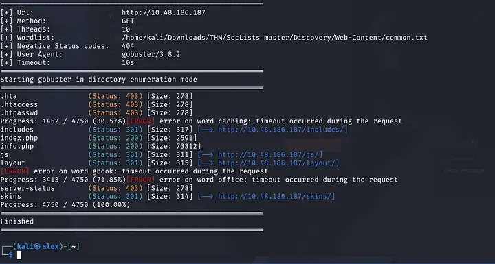
*Figure 3 — gobuster surfaces `/includes/`, `/js/`, `/layout/` and — most interesting — `/skins/`, alongside `index.php` and `info.php`.*

`/skins/` was a directory listing: `blue.php`, `default.php`, `green.php`, `red.php` — one file per theme. Parked for later.

---

## 03 Brute forcing the login — hydra

The root page redirects to an **Employee Authentication** page that helpfully references the helpdesk account — so the username was known and only the password was missing.

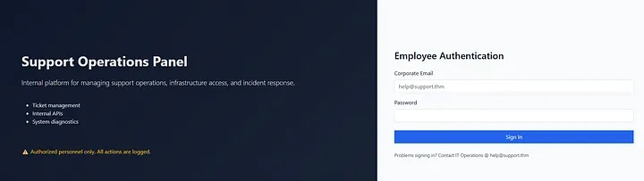
*Figure 4 — The login page names the helpdesk account `help@support.thm`.*

While discovery ran, I pointed **hydra**'s `http-post-form` module at the login with `rockyou.txt`:

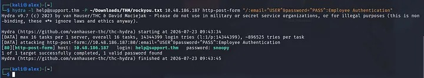
*Figure 5 — hydra finds a valid password: `help@support.thm : snoopy`.*

```
Cracked: help@support.thm : snoopy
```

---

## 04 First look — theme settings and a suspicious cookie

Logging in lands on a plain low-privilege helpdesk dashboard. Two things stood out:

- The footer has a **Select Theme** menu — and enumeration had already shown `/skins/` on the server, so the theme picker loads a PHP file from that folder. Holding onto that as possible **LFI** for later.
- Checking my cookies, a new **`isITUser`** cookie had appeared. From earlier rooms I guessed it was an MD5 hash — and I was correct.

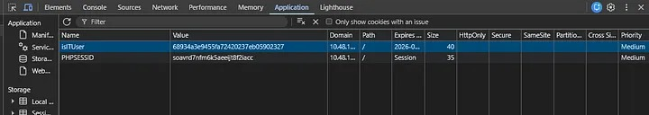
*Figure 6 — DevTools shows the new `isITUser` cookie next to `PHPSESSID`.*

---

## 05 Cracking the isITUser cookie

The value `68934a3e9455fa72420237eb05902327` looks exactly like an unsalted MD5. An online cracker confirms the hunch — it's the MD5 of **`false`**:

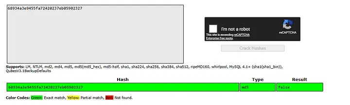
*Figure 7 — The cracker confirms `isITUser = md5("false") = 68934a3e9455fa72420237eb05902327`.*

So the role check comes down to a client-controlled boolean. Computing the MD5 of **`true`** in CyberChef:

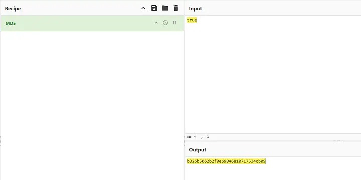
*Figure 8 — `md5("true") = b326b5062b2f0e69046810717534cb09`.*

```
Cookie: isITUser=b326b5062b2f0e69046810717534cb09
```

The dashboard itself is nothing special — a "Welcome, Helpdesk User" greeting and a ticket management box:

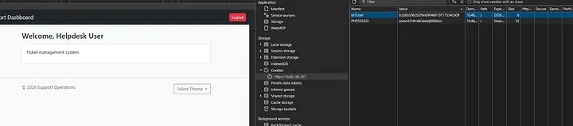
*Figure 9 — The plain "Welcome, Helpdesk User" dashboard before the swap.*

---

## 06 IT Admin Panel and the internal API

Swapping the cookie for `b326b5…` and reloading: the homepage immediately grew an **IT Admin Panel** with a **View API** button, and a new endpoint — **`/api`** — appeared.

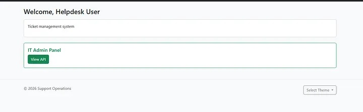
*Figure 10 — With the forged cookie, the dashboard grows an IT Admin Panel.*

The internal user API invites a helpdesk user to query their own profile at `/user/3`:

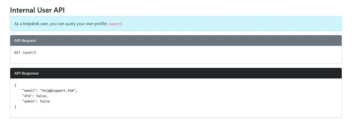
*Figure 11 — `/user/3` returns the email, 2FA status and admin flag for the helpdesk account.*

I played around requesting users 1 and 2 — nothing interesting came back — but an ID in the request that isn't tied to the session points to **BOLA**. Keep that in mind for later.

---

## 07 Skin LFI — source disclosure

Stuck for a while, I went back to the theme selector: it alters the page's dynamic content parameters, which I tested for **LFI**. Appending `../config` to the skin parameter makes the dashboard load `config.php` from outside the skins folder — and its source comes straight back, including a hard-coded master password:

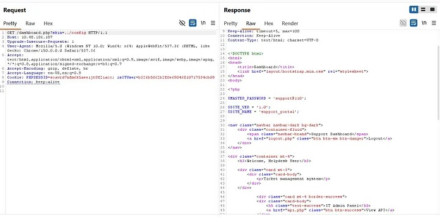
*Figure 12 — `dashboard.php?skin=../config` renders the portal's PHP source — `$MASTER_PASSWORD = 'support@110'`.*

**Key trick:** don't type `.php` in the payload — the app appends it, so `../config.php` would become `config.php.php` and fail. Use `../config`.

---

## 08 Admin username → admin flag

I had the master password but struggled to find the correct username — until I queried the **`/users/1`** endpoint (the users collection, not the `/api.php?id=#` profile form). That returns the email, 2FA status and `admin: true` — giving me `specialadmin@support.thm`.

Logging in with the master password kept failing… until I caught the trick: the `@` has to be removed.

```
email: specialadmin@support.thm   password: support110   # support@110 with the @ removed
```

That put me in the admin's shoes, and the first flag was on the homepage.

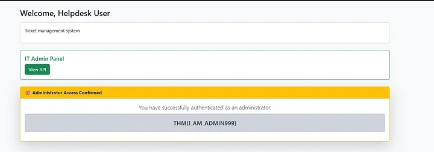
*Figure 13 — Administrator Access Confirmed — `THM{I_AM_ADMIN999}`.*

??? success "Flag 1 — click to reveal"

    ```
    THM{I_AM_ADMIN999}
    ```

---

## 09 Command injection via the date widget

Something interesting also came with admin rights: a new **date widget** in the footer. Changing the date fires a `POST /dashboard.php` carrying a **`sys`** parameter (`sys=date`) alongside the forged cookie:

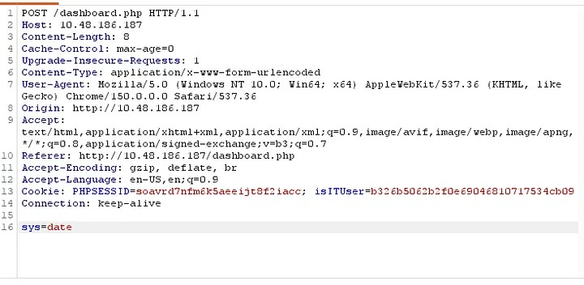
*Figure 14 — The request body carries `sys=date`; the server executes it.*

The `sys` argument is executed on the server. `cat /home/ubuntu/user.txt` on its own was blocked, and URL-encoding or Base64-encoding the command didn't get past the filter either. Falling back to path resources, a simple **`;`** separator did:

```
sys=date; cat /home/ubuntu/user.txt
```

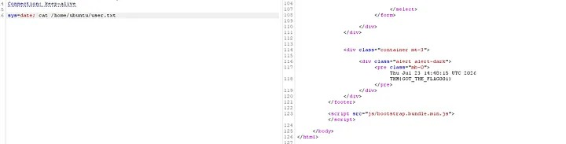
*Figure 15 — The output renders straight back into the page — the user flag.*

??? success "Flag 2 — click to reveal"

    ```
    THM{GOT_THE_FLAG001}
    ```

---

## 10 Reflection

- This room pushed me a lot and made me realise I need refreshers on a few topics.
- I really enjoyed it — but not the master-password/username section: having to drop the `@` from `support@110` felt pretty arbitrary. I got stuck there and had to read a Reddit post to get past it.

---

## Summary — the chain

| # | Weakness | Severity | What it gave me |
|---|---|---|---|
| 1 | Weak password / no login protection (hydra) | Medium | Helpdesk foothold (`snoopy`) |
| 2 | Client-side role trust (`isITUser` = unsalted MD5) | Critical | Forged IT role |
| 3 | BOLA-prone internal user API (`/users/1`) | High | Admin email |
| 4 | Skin loader path traversal (LFI) | Critical | Source + master password |
| 5 | Hard-coded master password in source | Critical | Admin login |
| 6 | Command injection in the date widget (`sys`) | Critical | Read `/home/ubuntu/user.txt` |

### Remediation

Strong passwords with lockout/rate-limiting; store roles server-side and never trust a client cookie for authorization; enforce object-level access so users read only their own profile; allow-list skin names and resolve them against the skins directory; remove and rotate hard-coded secrets and require MFA for admins; and never pass user input to a shell.

!!! note

    Flags: admin `THM{I_AM_ADMIN999}` · user `THM{GOT_THE_FLAG001}` — educational writeup for the TryHackMe [Support](https://tryhackme.com/room/support) room. For authorized lab use only.

---

| | |
|---|---|
| ← Previous | [HTB — Base](../../../HTB/Easy/Base/README.md) |
| Back to index | [All write-ups](../../../README.md) · [THM](../../README.md) · [THM — Medium](../README.md) |
| Next → | *Coming soon* |
